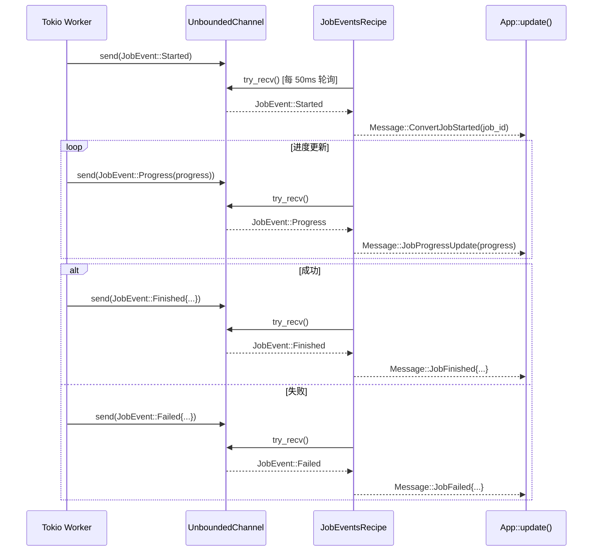

# PPT_Agent_Rust 接口定义 / API 契约 (Interface Definitions & API Contracts)

> 版本 1.0 · 2026-07-15
> 基于现有代码签名提取 + execution_plan.md 规格补全

---

## 1. 概述

本文档定义 PPT_Agent_Rust 各 crate 之间的**公开接口契约**，包括：

1. **Core Traits** — 各模块必须实现的抽象接口
2. **Data Contracts** — 跨模块传递的数据结构
3. **Internal APIs** — 各 crate 的公开函数签名
4. **Event Protocols** — 异步事件通信协议

所有接口按**依赖方向**组织：`core` 定义 trait → 物理模块实现 trait → `app` 消费。

---

## 2. Core Traits (pdf_agent_core::providers::traits)

### 2.1 DocumentProvider — PDF 文档提供者

```rust
/// 由 pdf_agent_pdf 实现
/// 提供 PDF 物理层的读取和渲染能力
pub trait DocumentProvider: Send + Sync {
    /// 返回 PDF 总页数
    fn page_count(&self) -> Result<usize>;

    /// 返回指定页面的宽高 (单位: PDF point, 1 point = 1/72 inch)
    /// page_index: 0-based
    fn page_size(&self, page_index: usize) -> Result<(f64, f64)>;

    /// 将指定页面渲染为 RGBA 位图
    /// page_index: 0-based
    /// dpi: 渲染分辨率 (常用值: 96=Layout检测, 150=UI预览, 192=OCR)
    /// 返回: PageImage { width, height, bytes: Vec<u8> (RGBA) }
    fn render_page(&self, page_index: usize, dpi: u32) -> Result<PageImage>;

    /// 提取指定页面的原生文本行
    /// page_index: 0-based
    /// 返回: 按 Y 坐标排序的文本行列表
    fn extract_native_text(&self, page_index: usize) -> Result<Vec<Line>>;
}
```

**约束:**
- 实现必须是 `Send + Sync`，支持跨线程共享
- `render_page` 返回的 bytes 为 RGBA 格式，像素按行主序排列
- `extract_native_text` 应处理字体编码异常，输出已规格化的 UTF-8 文本

---

### 2.2 OcrProvider — OCR 识别提供者

```rust
/// 由 pdf_agent_inference 实现
/// 对页面位图执行 OCR 文字识别
pub trait OcrProvider: Send + Sync {
    /// 对页面位图执行文字识别
    /// page_image: RGBA 原始字节
    /// width, height: 图片像素尺寸
    /// 返回: 识别出的文本行列表 (含坐标)
    fn recognize_text(
        &self,
        page_image: &[u8],
        width: u32,
        height: u32,
    ) -> Result<Vec<Line>>;
}
```

**包装服务:**

```rust
pub struct OcrService {
    provider: Arc<dyn OcrProvider>,
}

impl OcrService {
    pub fn new(provider: Arc<dyn OcrProvider>) -> Self;
    pub fn recognize_text(&self, page_image: &[u8], width: u32, height: u32) -> Result<Vec<Line>>;
}
```

---

### 2.3 LayoutProvider — 版面检测提供者

```rust
/// 由 pdf_agent_inference 实现
/// 对页面位图执行版面布局检测
pub trait LayoutProvider: Send + Sync {
    /// 检测页面的布局块
    /// page_image: RGBA 原始字节
    /// width, height: 图片像素尺寸
    /// 返回: 检测到的 Block 列表 (含 bbox + block_type)
    fn detect_layout(
        &self,
        page_image: &[u8],
        width: u32,
        height: u32,
    ) -> Result<Vec<Block>>;
}
```

**包装服务:**

```rust
pub struct LayoutService {
    provider: Arc<dyn LayoutProvider>,
}

impl LayoutService {
    pub fn new(provider: Arc<dyn LayoutProvider>) -> Self;
    pub fn detect_layout(&self, page_image: &[u8], width: u32, height: u32) -> Result<Vec<Block>>;
}
```

---

### 2.4 LlmService — 大语言模型服务

```rust
/// 由 pdf_agent_llm 实现
/// 统一的 LLM API 调用抽象
#[async_trait]
pub trait LlmService: Send + Sync {
    /// 发送补全请求，返回纯文本响应
    async fn complete(&self, request: LlmRequest) -> Result<String>;

    /// 发送补全请求，强制 JSON 模式，返回解析后的 JSON
    async fn complete_json(&self, request: LlmRequest) -> Result<serde_json::Value>;
}
```

**包装服务:**

```rust
pub struct LlmServiceWrapper {
    pub service: Arc<dyn LlmService>,
}

impl LlmServiceWrapper {
    pub fn new(service: Arc<dyn LlmService>) -> Self;
}
```

---

### 2.5 DocumentBuilder — 文档构建器

```rust
/// 由 pdf_agent_core::builders 实现
/// 从 DocumentProvider 构建初始 Document AST
pub trait DocumentBuilder {
    /// 读取 PDF 内容，构建文档树
    /// provider: PDF 物理层提供者
    /// ctx: 管道上下文 (含 OCR/Layout 服务注册)
    fn build(
        &self,
        provider: &dyn DocumentProvider,
        ctx: &PipelineContext,
    ) -> Result<Document>;
}
```

**已实现:**
- `TextDocumentBuilder` — 基于原生文本提取，OCR 降级逻辑

---

### 2.6 DocumentProcessor — 文档处理器

```rust
/// 由 pdf_agent_core::processors 实现
/// 对文档 AST 执行就地修改
pub trait DocumentProcessor: Send + Sync {
    /// 返回处理器名称 (用于日志和调试)
    fn name(&self) -> &'static str;

    /// 对文档执行处理
    /// document: 可变引用，处理器直接修改文档树
    /// ctx: 管道上下文
    fn process(
        &self,
        document: &mut Document,
        ctx: &PipelineContext,
    ) -> Result<()>;
}
```

**已实现的处理器:**

| 处理器                | name() 返回值          | 职责                    |
| --------------------- | ---------------------- | ---------------------- |
| `TableProcessor`      | `"table_processor"`    | 检测并标记表格块         |
| `HeadingProcessor`    | `"heading_processor"`  | 基于字体大小推断标题级别 |
| `ListProcessor`       | `"list_processor"`     | 检测并标记列表项         |
| `LineMergeProcessor`  | `"line_merge"`         | 合并相邻的连续文本行     |

---

### 2.7 DocumentRenderer — 文档渲染器

```rust
/// 由 pdf_agent_core::renderers 实现
/// 将 Document AST 渲染为目标格式
pub trait DocumentRenderer {
    /// 渲染输出类型
    type Output;

    /// 执行渲染
    /// document: 不可变引用
    /// ctx: 管道上下文
    fn render(
        &self,
        document: &Document,
        ctx: &PipelineContext,
    ) -> Result<Self::Output>;
}
```

**已实现:**
- `MarkdownRenderer` — `type Output = String`

**待实现:**
- `JsonRenderer` — `type Output = serde_json::Value`
- `HtmlRenderer` — `type Output = String`

---

## 3. Data Contracts (跨模块数据结构)

### 3.1 PageImage — 页面渲染结果

```rust
/// 定义于: pdf_agent_core::providers::traits
/// 用途: render_page() 返回值, UI 图片显示
#[derive(Debug, Clone)]
pub struct PageImage {
    pub width: u32,     // 像素宽度
    pub height: u32,    // 像素高度
    pub bytes: Vec<u8>, // RGBA 原始字节 (长度 = width * height * 4)
}
```

---

### 3.2 LlmRequest — LLM 请求体

```rust
/// 定义于: pdf_agent_core::providers::traits
/// 用途: 发送给 LlmService 的统一请求格式
#[derive(Debug, Clone, Serialize, Deserialize)]
pub struct LlmRequest {
    /// 系统提示词 (可选)
    pub system_prompt: Option<String>,
    /// 用户提示词 (必填)
    pub user_prompt: String,
    /// 采样温度 (可选, 默认由提供商决定)
    /// 范围: 0.0 ~ 2.0, 推荐局部修复用 0.2
    pub temperature: Option<f32>,
    /// 最大输出 Token 数 (可选)
    pub max_tokens: Option<usize>,
    /// 是否强制 JSON 输出模式
    pub json_mode: bool,
}
```

---

### 3.3 JobProgress — 任务进度

```rust
/// 定义于: pdf_agent_core::pipeline::job_event
/// 用途: 后台任务向 UI 上报进度
#[derive(Debug, Clone, Serialize, Deserialize)]
pub struct JobProgress {
    /// 任务 ID
    pub job_id: String,
    /// 当前管道阶段
    pub stage: PipelineStage,
    /// 当前处理页码 (0-based)
    pub current_page: usize,
    /// 总页数
    pub total_pages: usize,
    /// 已消耗时间 (秒)
    pub elapsed_seconds: f32,
}
```

---

### 3.4 JobEvent — 任务事件

```rust
/// 定义于: pdf_agent_core::pipeline::job_event
/// 用途: 后台 Worker → UI 的事件通信协议
#[derive(Debug, Clone, Serialize, Deserialize)]
pub enum JobEvent {
    /// 任务已启动
    Started {
        job_id: String,
    },
    /// 任务进度更新
    Progress(JobProgress),
    /// 任务成功完成
    Finished {
        job_id: String,
        /// 渲染后的 Markdown 文本
        markdown: String,
        /// 最终的文档 AST
        document: Document,
    },
    /// 任务失败
    Failed {
        job_id: String,
        /// 错误描述
        error: String,
    },
}
```

---

### 3.5 PipelineStage — 管道阶段枚举

```rust
/// 定义于: pdf_agent_core::pipeline::stage
/// 用途: 标识转换管道的当前阶段
#[derive(Debug, Clone, Copy, PartialEq, Eq, Serialize, Deserialize)]
pub enum PipelineStage {
    Idle,               // 空闲
    LoadingPdf,         // 加载 PDF / 构建文档树
    LayoutAnalysis,     // 版面布局检测
    Ocr,                // OCR 文字识别
    RunningProcessors,  // 执行处理器链
    Rendering,          // 渲染输出格式
    Completed,          // 已完成
    Failed,             // 已失败
}
```

---

### 3.6 PipelineConfig — 管道配置

```rust
/// 定义于: pdf_agent_core::config
/// 用途: 控制转换行为的全局配置
#[derive(Debug, Clone, Serialize, Deserialize)]
pub struct PipelineConfig {
    /// OCR 模式: "auto" | "always" | "never"
    /// - auto: native text 失败时降级到 OCR
    /// - always: 全部页面强制 OCR
    /// - never: 仅提取原生文本
    pub ocr_mode: String,
    /// 输出格式: "markdown" | "json" | "html"
    pub output_format: String,
    /// LLM 配置
    pub llm: LlmConfig,
}

#[derive(Debug, Clone, Serialize, Deserialize)]
pub struct LlmConfig {
    /// LLM 提供商: "mock" | "openai" | "gemini" | "anthropic" | "ollama"
    pub provider: String,
    /// 模型名称: e.g. "gpt-4o-mini", "gemini-1.5-pro"
    pub model_name: String,
    /// API 基础 URL
    pub base_url: String,
    /// 每日 Token 配额上限
    pub daily_limit: i64,
}
```

---

### 3.7 CancelToken — 任务取消令牌

```rust
/// 定义于: pdf_agent_core::pipeline::cancel_token
/// 用途: 协作式任务取消机制
#[derive(Clone)]
pub struct CancelToken {
    cancelled: Arc<AtomicBool>,
}

impl CancelToken {
    pub fn new() -> Self;
    /// 标记任务为已取消
    pub fn cancel(&self);
    /// 检查是否已取消
    pub fn is_cancelled(&self) -> bool;
}
```

---

## 4. Internal APIs (各 Crate 公开方法)

### 4.1 pdf_agent_core::runtime::JobManager

```rust
pub struct JobManager {
    active_jobs: Arc<Mutex<HashMap<String, ActiveJob>>>,
    converter: Arc<PdfConverter>,
}

impl JobManager {
    /// 创建新的 JobManager
    pub fn new() -> Self;

    /// 启动转换任务
    /// 返回事件接收通道，调用方通过 try_recv 获取 JobEvent
    ///
    /// # 参数
    /// - job_id: 唯一任务标识 (建议格式: "job_{unix_millis}")
    /// - provider: PDF 文档提供者 (需 Arc 包装以跨线程传递)
    /// - ctx: 管道上下文 (含 ServiceRegistry)
    ///
    /// # 线程安全
    /// 内部使用 tokio::spawn 在后台执行，不阻塞调用线程
    pub fn start_job(
        &self,
        job_id: String,
        provider: Arc<dyn DocumentProvider>,
        ctx: Arc<PipelineContext>,
    ) -> UnboundedReceiver<JobEvent>;

    /// 取消正在执行的任务
    /// 返回 true 表示成功取消，false 表示任务不存在
    pub fn cancel_job(&self, job_id: &str) -> bool;
}
```

---

### 4.2 pdf_agent_core::pipeline::PdfConverter

```rust
pub struct PdfConverter {
    processors: Vec<Box<dyn DocumentProcessor>>,
}

impl PdfConverter {
    /// 创建默认转换器 (含 4 个内置处理器)
    /// 处理器执行顺序: Table → Heading → List → LineMerge
    pub fn new() -> Self;

    /// 执行完整转换管道
    ///
    /// # 参数
    /// - job_id: 任务标识 (用于事件上报)
    /// - provider: PDF 文档提供者
    /// - ctx: 管道上下文
    /// - cancel_token: 取消令牌 (各阶段间检查)
    /// - event_sender: 进度事件发送通道 (可选)
    ///
    /// # 返回
    /// (markdown_string, document_ast)
    ///
    /// # 错误
    /// - Error::Cancelled — 任务被取消
    /// - Error::Pdf — PDF 解析错误
    /// - Error::Pipeline — 处理器执行错误
    pub async fn convert(
        &self,
        job_id: &str,
        provider: &dyn DocumentProvider,
        ctx: &PipelineContext,
        cancel_token: &CancelToken,
        event_sender: Option<UnboundedSender<JobEvent>>,
    ) -> Result<(String, Document)>;
}
```

---

### 4.3 pdf_agent_core::context

```rust
/// 管道执行上下文
pub struct PipelineContext {
    pub config: PipelineConfig,
    pub registry: ServiceRegistry,
}

impl PipelineContext {
    pub fn new(config: PipelineConfig, registry: ServiceRegistry) -> Self;
}

/// 类型安全的服务注册中心
/// 使用 TypeId 作为 key，支持按类型注册和获取服务实例
pub struct ServiceRegistry {
    services: HashMap<TypeId, Arc<dyn Any + Send + Sync>>,
}

impl ServiceRegistry {
    pub fn new() -> Self;

    /// 注册服务实例
    /// T 必须是 Send + Sync + 'static
    /// 同类型重复注册会覆盖前一个
    pub fn register<T: Send + Sync + 'static>(&mut self, service: Arc<T>);

    /// 按类型获取已注册的服务
    /// 返回 None 表示该类型未注册
    pub fn get<T: Send + Sync + 'static>(&self) -> Option<Arc<T>>;
}
```

---

### 4.4 pdf_agent_core::schema::Document

```rust
pub struct Document {
    pub file_name: String,
    pub pages: Vec<Page>,
    pub metadata: HashMap<String, String>,
}

impl Document {
    /// 创建新文档
    pub fn new(file_name: String, pages: Vec<Page>) -> Self;

    /// 查找 Block 及其上下文 (前一个 Block + 目标 Block + 后一个 Block)
    /// 用于 LLM 局部修复时构建上下文窗口
    ///
    /// # 参数
    /// - block_id: Block 唯一标识 (格式: "p{page}_b{idx}")
    ///
    /// # 返回
    /// Some((prev_block, target_block, next_block))
    /// - prev_block: 前一个 Block (若 target 是页首则为 None)
    /// - next_block: 后一个 Block (若 target 是页尾则为 None)
    pub fn find_block_with_context(
        &self,
        block_id: &str,
    ) -> Option<(Option<&Block>, &Block, Option<&Block>)>;

    /// 更新指定 Block 的文本内容
    /// 返回 true 表示找到并更新成功
    pub fn update_block_text(&mut self, block_id: &str, new_text: &str) -> bool;
}
```

---

### 4.5 pdf_agent_pdf::PdfProvider

```rust
/// PDF 物理层提供者
/// 内部使用 lopdf + pdfium-render
pub struct PdfProvider { /* ... */ }

impl PdfProvider {
    /// 打开 PDF 文件
    /// 解析 PDF 逻辑结构，建立字体表
    ///
    /// # 错误
    /// - Error::Pdf — 文件不存在 / 格式无效 / 密码保护
    pub fn open(path: &Path) -> Result<Self>;
}

/// 实现 DocumentProvider trait
impl DocumentProvider for PdfProvider {
    fn page_count(&self) -> Result<usize>;
    fn page_size(&self, page_index: usize) -> Result<(f64, f64)>;
    fn render_page(&self, page_index: usize, dpi: u32) -> Result<PageImage>;
    fn extract_native_text(&self, page_index: usize) -> Result<Vec<Line>>;
}
```

---

### 4.6 pdf_agent_inference Predictors

```rust
/// Layout 版面检测器 (ONNX 模型)
pub struct LayoutPredictor;

impl LayoutPredictor {
    pub fn new() -> Self;
}

impl LayoutProvider for LayoutPredictor {
    /// 当前为 Stub 实现，返回空列表
    /// 后续接入 ONNX Runtime 后返回检测到的 Block 列表
    fn detect_layout(&self, page_image: &[u8], width: u32, height: u32) -> Result<Vec<Block>>;
}

/// OCR 文字识别器 (ONNX 模型)
pub struct OcrPredictor;

impl OcrPredictor {
    pub fn new() -> Self;
}

impl OcrProvider for OcrPredictor {
    /// 当前为 Stub 实现，返回 mock 文本行
    /// 后续接入 ONNX Runtime 后返回真实识别结果
    fn recognize_text(&self, page_image: &[u8], width: u32, height: u32) -> Result<Vec<Line>>;
}
```

---

### 4.7 pdf_agent_llm Services

```rust
/// OpenAI 兼容 API 适配器
/// 支持所有 OpenAI API 兼容的服务端 (OpenAI, Azure, vLLM, etc.)
pub struct OpenAiLlmService {
    api_key: String,
    base_url: String,
    model_name: String,
    client: reqwest::Client,
}

impl OpenAiLlmService {
    /// 创建 OpenAI 兼容服务实例
    /// base_url: 不含 /chat/completions 后缀
    pub fn new(api_key: String, base_url: String, model_name: String) -> Self;
}

#[async_trait]
impl LlmService for OpenAiLlmService {
    /// 发送 Chat Completion 请求
    /// HTTP POST {base_url}/chat/completions
    ///
    /// # 请求体
    /// {
    ///   "model": model_name,
    ///   "messages": [
    ///     {"role": "system", "content": system_prompt},  // 可选
    ///     {"role": "user", "content": user_prompt}
    ///   ],
    ///   "temperature": temperature,  // 可选
    ///   "max_tokens": max_tokens,    // 可选
    ///   "response_format": {"type": "json_object"}  // json_mode=true 时
    /// }
    ///
    /// # 响应解析
    /// 提取 response.choices[0].message.content
    async fn complete(&self, request: LlmRequest) -> Result<String>;

    /// 强制 JSON 模式补全
    /// 内部设置 json_mode=true 后调用 complete()
    /// 将响应文本解析为 serde_json::Value
    async fn complete_json(&self, request: LlmRequest) -> Result<serde_json::Value>;
}

/// Mock LLM 服务 (用于开发和测试)
pub struct MockLlmService;

#[async_trait]
impl LlmService for MockLlmService {
    /// 返回固定 mock 响应
    /// json_mode=true: '{"patched_markdown": "..."}'
    /// json_mode=false: "This is a mocked LLM completion response."
    async fn complete(&self, request: LlmRequest) -> Result<String>;
    async fn complete_json(&self, request: LlmRequest) -> Result<serde_json::Value>;
}
```

---

### 4.8 pdf_agent_llm::rate_limit::TokenBucket

```rust
/// 令牌桶限流器
/// 用于控制 LLM API 调用频率
pub struct TokenBucket { /* ... */ }

impl TokenBucket {
    /// 创建令牌桶
    /// capacity: 桶容量 (最大令牌数)
    /// refill_rate: 每秒补充的令牌数
    pub fn new(capacity: i64, refill_rate: i64) -> Self;

    /// 尝试消费 tokens 个令牌
    /// 返回 true 表示成功消费，false 表示令牌不足
    pub fn try_consume(&self, tokens: i64) -> bool;

    /// 获取当前可用令牌数
    pub fn available(&self) -> i64;
}
```

---

### 4.9 pdf_agent_storage APIs

```rust
/// SQLite 数据库连接
pub struct DbConnection { /* ... */ }

impl DbConnection {
    /// 创建内存数据库 (测试用)
    pub fn new_in_memory() -> Result<Self>;

    /// 打开/创建磁盘数据库文件
    /// 自动执行 schema 初始化 (CREATE TABLE IF NOT EXISTS)
    pub fn open<P: AsRef<Path>>(path: P) -> Result<Self>;

    /// 获取底层 rusqlite::Connection 引用
    pub fn get_conn(&self) -> &Connection;

    /// 查询指定日期的已消耗 Token 数
    /// date: 日期键 (格式: "day_{epoch_days}")
    /// 返回: 已消耗的 Token 总数 (未找到记录返回 0)
    pub fn get_tokens_used(&self, date: &str) -> Result<i64>;

    /// 增加指定日期的 Token 消耗量
    /// 使用 UPSERT 语义: INSERT ... ON CONFLICT DO UPDATE
    /// amount: 本次消耗的 Token 数
    /// limit_threshold: 当日配额上限
    pub fn increment_tokens_used(
        &self,
        date: &str,
        amount: i64,
        limit_threshold: i64,
    ) -> Result<()>;
}

/// 系统密钥环存储
pub struct KeyringStore { /* ... */ }

impl KeyringStore {
    /// 创建 KeyringStore (service_name = "ppt-agent-rust")
    pub fn new() -> Self;

    /// 存储 API Key 到系统密钥环
    /// provider: 密钥别名 (e.g. "openai", "gemini")
    /// api_key: 明文 API Key
    pub fn set_api_key(&self, provider: &str, api_key: &str) -> Result<()>;

    /// 从系统密钥环读取 API Key
    /// 返回: 明文 API Key
    pub fn get_api_key(&self, provider: &str) -> Result<String>;

    /// 从系统密钥环删除 API Key
    pub fn delete_api_key(&self, provider: &str) -> Result<()>;
}
```

---

## 5. Event Communication Protocol (事件通信协议)

### 5.1 后台任务 → UI 事件流



### 5.2 事件映射表

| JobEvent                  | → Message                           | UI 行为                             |
| ------------------------- | ----------------------------------- | ----------------------------------- |
| `Started { job_id }`     | `ConvertJobStarted(job_id)`         | MainState → Converting              |
| `Progress(progress)`     | `JobProgressUpdate(progress)`       | 更新进度步进器                       |
| `Finished { markdown, document }` | `JobFinished { markdown, document }` | MainState → Converted; 初始化 history |
| `Failed { error }`       | `JobFailed { error }`               | MainState → Failed; 显示错误         |

### 5.3 Subscription 实现

```rust
/// Iced 事件订阅 Recipe
/// 通过 50ms 定时轮询 UnboundedReceiver 接收后台事件
struct JobEventsRecipe {
    rx_mutex: Arc<Mutex<Option<UnboundedReceiver<JobEvent>>>>,
}

impl iced::advanced::subscription::Recipe for JobEventsRecipe {
    type Output = Message;

    fn hash(&self, state: &mut Hasher) {
        TypeId::of::<Self>().hash(state);
    }

    fn stream(self: Box<Self>, _input: EventStream)
        -> BoxStream<'static, Message>
    {
        // 内部 loop:
        // 1. lock rx_mutex
        // 2. try_recv() from receiver
        // 3. map JobEvent → Message
        // 4. yield Message
        // 5. sleep 50ms
    }
}
```

---

## 6. Error Contract (错误契约)

### 6.1 统一错误类型

```rust
/// 定义于: pdf_agent_core::error
/// 所有 crate 公开 API 使用此错误类型
#[derive(thiserror::Error, Debug)]
pub enum Error {
    #[error("I/O error: {0}")]
    Io(#[from] std::io::Error),

    #[error("Serialization error: {0}")]
    Serialization(#[from] serde_json::Error),

    #[error("Database error: {0}")]
    Database(String),

    #[error("PDF processing error: {0}")]
    Pdf(String),

    #[error("Inference/OCR error: {0}")]
    Inference(String),

    #[error("LLM Service error: {0}")]
    Llm(String),

    #[error("Pipeline error at stage {stage}: {message}")]
    Pipeline { stage: String, message: String },

    #[error("Job cancelled")]
    Cancelled,

    #[error("General error: {0}")]
    General(String),
}

pub type Result<T> = std::result::Result<T, Error>;
```

### 6.2 各 Crate 错误映射

| 源 Crate           | 源错误类型                  | 映射到 Core Error          |
| ------------------- | -------------------------- | ------------------------- |
| `pdf_agent_pdf`    | `lopdf::Error`             | `Error::Pdf(msg)`         |
| `pdf_agent_pdf`    | `pdfium_render::Error`     | `Error::Pdf(msg)`         |
| `pdf_agent_inference` | `ort::Error`           | `Error::Inference(msg)`   |
| `pdf_agent_llm`    | `reqwest::Error`           | `Error::Llm(msg)`         |
| `pdf_agent_llm`    | HTTP 4xx/5xx               | `Error::Llm(status + body)`|
| `pdf_agent_storage`| `rusqlite::Error`          | `Error::Database(msg)`    |
| `pdf_agent_storage`| `keyring::Error`           | `Error::Database(msg)`    |

---

## 7. LLM Prompt Protocol (Prompt 协议)

### 7.1 局部 Block 修复 Prompt

**System Prompt:**
```text
You are an assistant correcting OCR and layout parsing errors in a document block.
Output only the corrected text for the target block.
Do not wrap in markdown code blocks unless the block itself is a code block.
```

**User Prompt 模板:**
```text
Context:
- Previous Block: {prev_block.text}
- Target Block: {target_block.text}
- Next Block: {next_block.text}

User Feedback: {user_feedback}

Corrected Target Block text:
```

**期望响应:**
```text
纯文本，直接为 Block 的 corrected text
不包含 markdown 代码块包裹
不包含解释或说明
```

### 7.2 Token 消耗估算

```text
estimated_tokens = (corrected_text.len() + system_prompt.len()) / 4
```

- 使用 ASCII 字符长度 / 4 的粗略估算
- 中文字符按约 2 token/字符估算
- 记录到 SQLite quotas 表

---

## 8. 接口版本兼容性约束

| 约束项                     | 规则                                                     |
| ------------------------- | -------------------------------------------------------- |
| trait 签名变更             | BREAKING — 需要同步更新所有实现方                          |
| struct 新增可选字段         | 兼容 — 使用 `#[serde(default)]`                          |
| enum 新增变体              | BREAKING — 所有 match 必须增加分支                        |
| Error 新增变体             | 兼容 — 上层使用 `_` 通配处理                               |
| PipelineConfig 新增字段    | 兼容 — 使用 `Default` trait 提供默认值                     |
| Message 新增变体           | 兼容 — `update()` 增加新的 match arm                      |
| SQLite schema 新增表/列    | 使用 migrations 管理，`CREATE TABLE IF NOT EXISTS`        |
