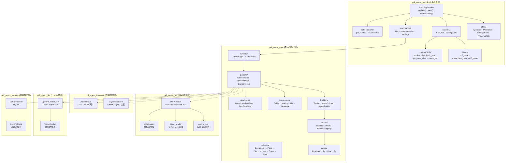
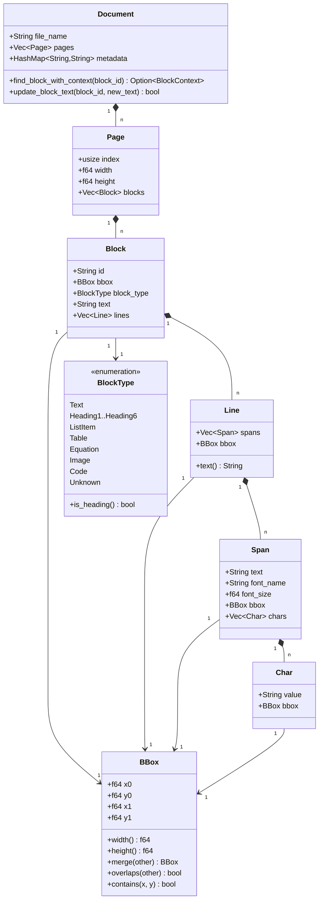
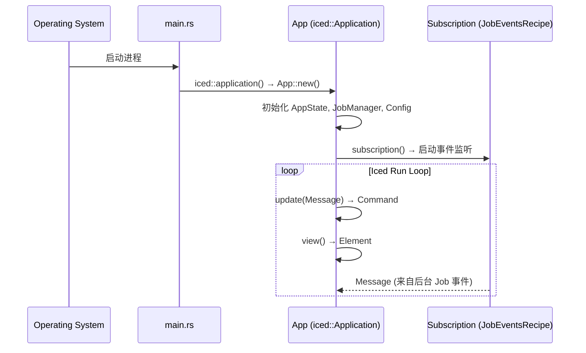
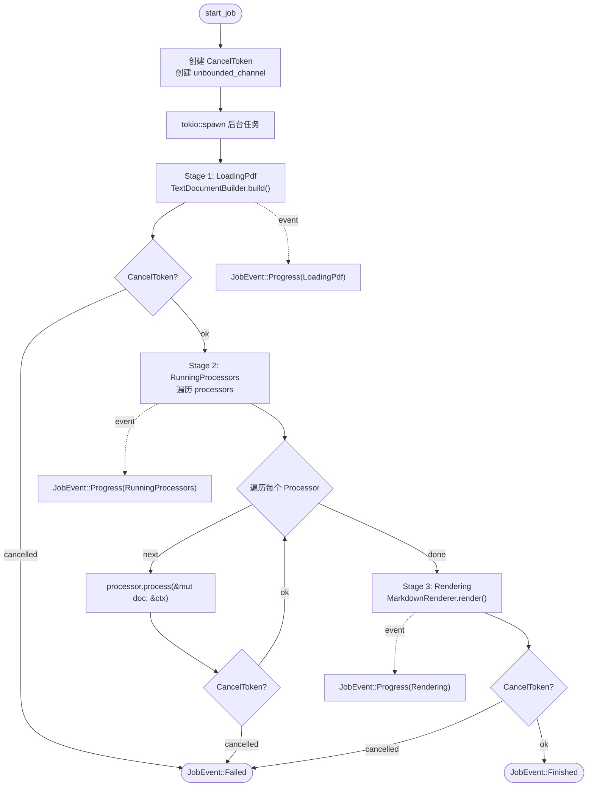
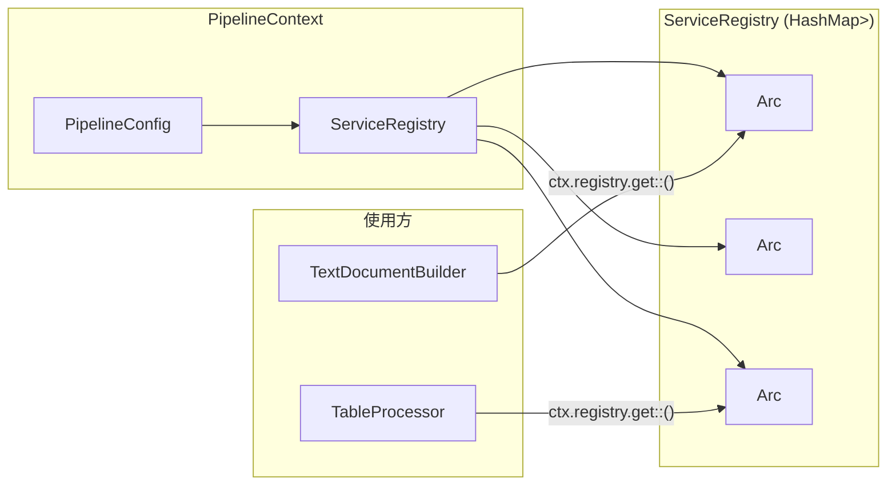
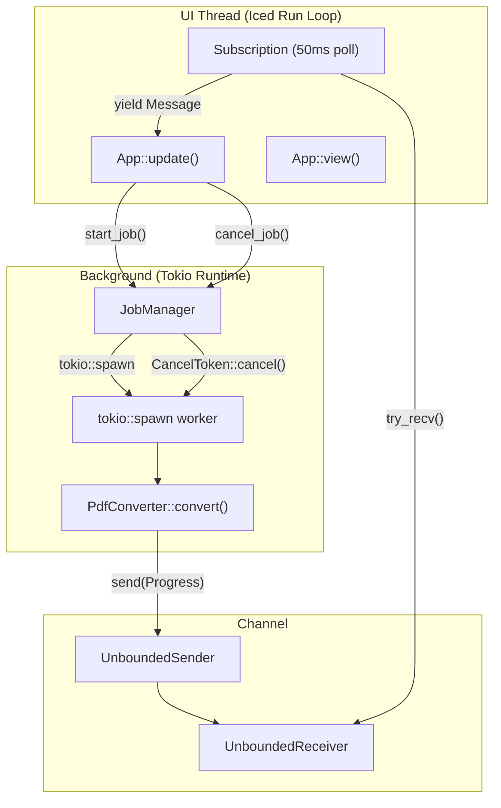
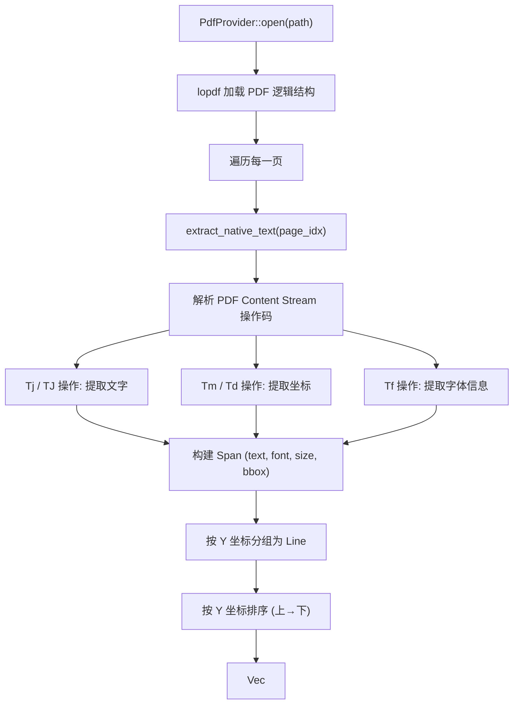
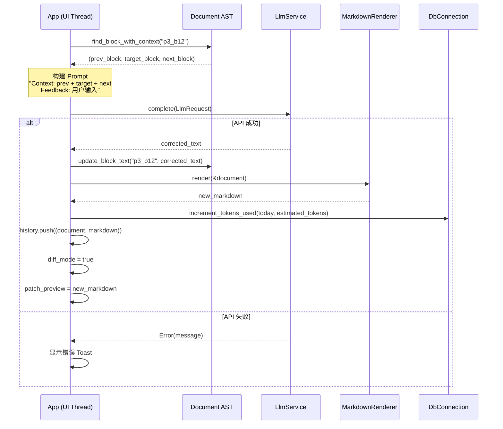

# PPT_Agent_Rust 客户端详细设计 (Client Detailed Design)

> 版本 1.0 · 2026-07-15
> 基于 execution_plan.md 与实际代码分析

---

## 1. 系统概述

PPT_Agent_Rust 是一个基于 Rust + iced 的高性能 PDF 转 Markdown 桌面客户端。系统架构采用 **Cargo Workspace + 分层管道 + iced UI 壳层** 模式，核心设计原则是「PDF 转换引擎 + 桌面壳」而非「桌面项目里加 PDF 功能」。

### 1.1 系统架构图



### 1.2 依赖方向约束

```text
pdf_agent_app → pdf_agent_core, pdf_agent_storage, pdf_agent_pdf,
                pdf_agent_inference, pdf_agent_llm
pdf_agent_core → pdf_agent_pdf (via trait), pdf_agent_inference (via trait),
                 pdf_agent_llm (via trait)
pdf_agent_pdf → 不依赖 app, core
pdf_agent_inference → 不依赖 app
pdf_agent_llm → 不依赖 app
pdf_agent_storage → 不依赖 app
pdf_agent_cli → pdf_agent_core
```

> **严格约束**: `core` 只通过 trait 与物理模块交互，底层模块严禁反向依赖 `app` 或 `core`。

---

## 2. 数据模型详细设计

### 2.1 文档树模型 (Document AST)



### 2.2 Block ID 命名规则

```text
格式:  p{page_index}_b{block_index}
示例:  p0_b0, p0_b1, p3_b12
```

- `page_index`: 页码索引（从 0 开始）
- `block_index`: 该页内 Block 的顺序索引（从 0 开始）
- 全文档唯一标识，用于 LLM 局部 Patch 定位

### 2.3 配置数据模型

```rust
pub struct PipelineConfig {
    pub ocr_mode: String,       // "auto" | "always" | "never"
    pub output_format: String,  // "markdown" | "json" | "html"
    pub llm: LlmConfig,
}

pub struct LlmConfig {
    pub provider: String,       // "mock" | "openai" | "gemini" | "anthropic" | "ollama"
    pub model_name: String,     // e.g. "gpt-4o-mini"
    pub base_url: String,       // e.g. "https://api.openai.com/v1"
    pub daily_limit: i64,       // e.g. 50000
}
```

### 2.4 存储数据模型

#### SQLite Schema

```sql
-- 转换任务记录
CREATE TABLE jobs (
    id TEXT PRIMARY KEY,
    file_path TEXT NOT NULL,
    status TEXT NOT NULL,         -- "pending" | "running" | "completed" | "failed" | "cancelled"
    progress_stage TEXT NOT NULL, -- PipelineStage 枚举字符串
    current_page INTEGER NOT NULL,
    total_pages INTEGER NOT NULL,
    created_at TEXT NOT NULL,     -- ISO 8601
    updated_at TEXT NOT NULL,
    error_message TEXT
);

-- 文档版本记录
CREATE TABLE documents (
    id TEXT PRIMARY KEY,
    job_id TEXT NOT NULL,
    file_path TEXT NOT NULL,
    markdown_content TEXT NOT NULL,
    version_id INTEGER NOT NULL,
    created_at TEXT NOT NULL,
    FOREIGN KEY(job_id) REFERENCES jobs(id)
);

-- Token 配额记录
CREATE TABLE quotas (
    date TEXT PRIMARY KEY,        -- "day_20345" (UNIX epoch / 86400)
    tokens_used INTEGER NOT NULL,
    limit_threshold INTEGER NOT NULL
);
```

---

## 3. 应用层详细设计 (pdf_agent_app)

### 3.1 App 生命周期



### 3.2 App 结构体

```rust
pub struct App {
    // 路由
    pub route: Route,                    // Main | Settings

    // 主页面状态机
    pub main_state: MainState,           // Empty | PdfLoaded | Converting | Converted | Failed

    // PDF 相关
    pub current_file_path: Option<PathBuf>,
    pub current_page_index: usize,
    pub total_pages: usize,
    pub rendered_page_image: Option<PageImage>,
    pub is_loading_image: bool,
    pub image_error: Option<String>,

    // 转换引擎
    pub job_manager: Arc<JobManager>,
    pub current_job_id: Option<String>,
    pub event_receiver: Arc<Mutex<Option<UnboundedReceiver<JobEvent>>>>,

    // LLM 反馈
    pub feedback_input: String,
    pub selected_block_id: Option<String>,
    pub diff_mode: bool,
    pub patch_preview: Option<String>,

    // 版本历史
    pub history: Vec<(Document, String)>, // (Document AST, Markdown 快照)
    pub history_index: usize,             // 当前版本指针

    // 配置
    pub config: PipelineConfig,
    pub api_key: String,
}
```

### 3.3 消息总线 (Message Enum)

```rust
pub enum Message {
    // ─── 路由 ───
    TabChanged(Route),

    // ─── PDF 文件操作 ───
    OpenFileClicked,
    PdfLoaded { path: PathBuf, page_count: usize },
    PdfLoadFailed(String),
    PageChanged(usize),
    PageImageLoaded { page_index: usize, image: PageImage },
    PageImageLoadFailed(String),

    // ─── 转换流程 ───
    ConvertClicked,
    ConvertJobStarted(String),
    JobProgressUpdate(JobProgress),
    JobFinished { job_id: String, markdown: String, document: Document },
    JobFailed { job_id: String, error: String },
    CancelClicked,

    // ─── LLM 反馈 ───
    FeedbackInputChanged(String),
    SubmitFeedbackClicked,
    BlockSelected(Option<String>),
    LlmFeedbackResult(Result<(String, Document), String>),

    // ─── Diff 操作 ───
    AcceptPatchClicked,
    RejectPatchClicked,

    // ─── 版本历史 ───
    UndoClicked,
    RedoClicked,

    // ─── Settings ───
    OcrModeChanged(String),
    OutputFormatChanged(String),
    LlmProviderChanged(String),
    LlmModelChanged(String),
    LlmBaseUrlChanged(String),
    LlmKeyChanged(String),
    LlmLimitChanged(String),
    SaveSettingsClicked,
}
```

### 3.4 状态转换矩阵

| 当前状态        | 触发 Message              | 目标状态        | 副作用                                    |
| -------------- | ------------------------- | -------------- | ----------------------------------------- |
| `Empty`        | `PdfLoaded`               | `PdfLoaded`    | 设置 file_path, page_count; 渲染首页        |
| `Empty`        | `PdfLoadFailed`           | `Failed`       | 设置 error                                 |
| `PdfLoaded`    | `ConvertClicked`          | `Converting`   | 创建 JobId; 注册 OCR/Layout/LLM 服务; 启动后台任务 |
| `PdfLoaded`    | `PdfLoaded`               | `PdfLoaded`    | 切换文件; 重置页码                           |
| `Converting`   | `JobProgressUpdate`       | `Converting`   | 更新 progress (stage, page, elapsed)       |
| `Converting`   | `JobFinished`             | `Converted`    | 设置 markdown, document; 初始化 history     |
| `Converting`   | `JobFailed`               | `Failed`       | 设置 error                                 |
| `Converting`   | `CancelClicked`           | `PdfLoaded`    | 调用 cancel_token.cancel()                 |
| `Converted`    | `SubmitFeedbackClicked`   | `Converted`*   | 异步调用 LLM; 清空 feedback_input            |
| `Converted`    | `LlmFeedbackResult(Ok)`  | `Converted`**  | 设置 diff_mode=true, patch_preview          |
| `Converted`**  | `AcceptPatchClicked`      | `Converted`    | history_index 前进; 更新 MainState           |
| `Converted`**  | `RejectPatchClicked`      | `Converted`    | 截断 history; 清除 patch_preview             |
| `Converted`    | `UndoClicked`             | `Converted`    | history_index -= 1; 回退文档版本             |
| `Converted`    | `RedoClicked`             | `Converted`    | history_index += 1; 前进文档版本             |
| `Failed`       | `OpenFileClicked`         | `PdfLoaded`    | 重新加载                                    |

> `*` 等待 LLM 响应中
> `**` diff_mode = true

### 3.5 组件拆分计划

当前 `app.rs` (26KB, 571行) 和 `main_tab.rs` (291行) 承载了过多逻辑，需要按以下计划拆分：

```text
crates/pdf_agent_app/src/
├── main.rs                          # 应用入口 (不变)
├── app.rs                           # Application trait 骨架 (精简至 ~150行)
├── message.rs                       # Message enum (不变)
├── theme.rs                         # Palette + 字体常量 (扩充)
│
├── state/
│   ├── mod.rs
│   ├── app_state.rs                 # App 顶层状态 (不变)
│   ├── main_state.rs                # MainState enum (不变)
│   ├── settings_state.rs            # [NEW] SettingsState struct
│   └── preview_state.rs             # [NEW] 滚动/缩放/页码同步状态
│
├── screens/
│   ├── mod.rs
│   ├── main_tab.rs                  # 拆分至 panes + components 后精简
│   └── settings_tab.rs              # 拆分至 components 后精简
│
├── panes/                           # [NEW] 核心面板组件
│   ├── mod.rs
│   ├── pdf_pane.rs                  # 左侧 PDF 预览 (从 main_tab 提取)
│   ├── markdown_pane.rs             # 右侧 Markdown 预览 + Block 列表
│   └── diff_pane.rs                 # Diff 预览面板 (similar 库集成)
│
├── components/                      # [NEW] 可复用组件
│   ├── mod.rs
│   ├── toolbar.rs                   # 底部横向工具栏
│   ├── feedback_box.rs              # 反馈输入框 + 上下文绑定
│   ├── progress_view.rs             # 阶段式进度步进器
│   ├── status_bar.rs                # 底部状态栏
│   ├── file_button.rs               # 文件操作按钮组
│   ├── convert_button.rs            # 转换按钮 (含 spinner)
│   ├── provider_selector.rs         # LLM 提供商选择器
│   └── api_key_editor.rs            # API Key 编辑器行
│
├── commands/                        # 后台异步命令
│   ├── mod.rs
│   ├── file_commands.rs             # PDF 打开/页面渲染
│   ├── conversion_commands.rs       # 转换任务启动
│   ├── llm_commands.rs              # LLM 反馈提交
│   └── settings_commands.rs         # 配置读写/Keyring 存储
│
└── subscriptions/                   # Iced 事件订阅
    ├── mod.rs
    └── job_events.rs                # JobEventsRecipe (从 app.rs 提取)
```

---

## 4. 核心引擎详细设计 (pdf_agent_core)

### 4.1 转换管道流程



### 4.2 Processor 执行顺序

```text
序号  Processor                    职责                           状态
──────────────────────────────────────────────────────────────────────
 1   TableProcessor               表格块识别与格式化               ✅ 已实现
 2   HeadingProcessor             标题级别检测与标记               ✅ 已实现
 3   ListProcessor                列表项检测与归并                 ✅ 已实现
 4   LineMergeProcessor           相邻文本行智能合并               ✅ 已实现
──────────────────────────────────────────────────────────────────────
 5   OrderProcessor               阅读顺序重排                    □ 待实现
 6   BlockRelabelProcessor        Block 类型二次判定               □ 待实现
 7   TableMergeProcessor          跨页表格合并                    □ 待实现
 8   EquationProcessor            公式块识别与 LaTeX 解包          □ 待实现
 9   TocProcessor                 目录生成                        □ 待实现
10   LlmSimpleMetaProcessor       LLM 元批处理器                  □ 待实现
11   DebugProcessor               调试输出                        □ 待实现
```

### 4.3 服务注册与依赖注入



**注册流程 (在 ConvertClicked handler 中):**

```rust
// 1. 创建 ServiceRegistry
let mut registry = ServiceRegistry::new();

// 2. 注册 OCR 服务
let ocr_predictor = Arc::new(OcrPredictor::new());
let ocr_service = Arc::new(OcrService::new(ocr_predictor));
registry.register(ocr_service);

// 3. 注册 Layout 服务
let layout_predictor = Arc::new(LayoutPredictor::new());
let layout_service = Arc::new(LayoutService::new(layout_predictor));
registry.register(layout_service);

// 4. 注册 LLM 服务
let llm_service: Arc<dyn LlmService> = match provider_name {
    "mock" => Arc::new(MockLlmService),
    _      => Arc::new(OpenAiLlmService::new(api_key, base_url, model)),
};
registry.register(Arc::new(LlmServiceWrapper::new(llm_service)));

// 5. 创建 PipelineContext
let ctx = Arc::new(PipelineContext::new(config, registry));
```

### 4.4 JobManager 线程模型



**关键设计约束:**
- UI 线程**零阻塞**: 所有 PDF 解析、ONNX 推理、HTTP 请求在 Tokio worker 中执行
- 事件轮询间隔: 50ms (`tokio::time::sleep(Duration::from_millis(50))`)
- 使用 `UnboundedChannel` 避免背压阻塞
- `CancelToken` 基于 `AtomicBool`，各 Pipeline 阶段间检查

---

## 5. PDF 物理层详细设计 (pdf_agent_pdf)

### 5.1 DocumentProvider trait 实现

```rust
pub trait DocumentProvider: Send + Sync {
    fn page_count(&self) -> Result<usize>;
    fn page_size(&self, page_index: usize) -> Result<(f64, f64)>;
    fn render_page(&self, page_index: usize, dpi: u32) -> Result<PageImage>;
    fn extract_native_text(&self, page_index: usize) -> Result<Vec<Line>>;
}
```

### 5.2 双通道 DPI 管道

```text
┌─────────────────────────────────────────────────┐
│ 通道 A: 96 DPI (低分辨率)                        │
│ ├─ 用途: Layout 检测 · Detection 模型             │
│ ├─ 触发: 每页必须                                 │
│ ├─ 内存: ~200KB/page                              │
│ └─ 生命周期: 推理完毕即 Drop                       │
│                                                   │
│ 通道 B: 150-192 DPI (高分辨率)                     │
│ ├─ 用途: OCR 识别 · UI 预览                        │
│ ├─ 触发: 按需 (native text 失败时 / UI 翻页时)     │
│ ├─ 内存: ~800KB/page                              │
│ └─ 生命周期: OCR 完毕 Drop / UI 缓存 1 页          │
└─────────────────────────────────────────────────┘
```

### 5.3 原生文本提取流程



---

## 6. 推理层详细设计 (pdf_agent_inference)

### 6.1 模型加载策略

```text
模型类型            加载时机              卸载时机             文件大小(估)
──────────────────────────────────────────────────────────────────────
LayoutPredictor     App 启动时常驻        App 关闭            ~15MB
DetectionPredictor  App 启动时常驻        App 关闭            ~10MB
OcrPredictor        Native Text 失败时    OCR 完成后即 Drop    ~100MB
RecognitionPredictor 按需惰性加载         使用后即 Drop        ~200MB
```

### 6.2 OcrProvider trait

```rust
pub trait OcrProvider: Send + Sync {
    fn recognize_text(
        &self,
        page_image: &[u8],
        width: u32,
        height: u32
    ) -> Result<Vec<Line>>;
}
```

### 6.3 LayoutProvider trait

```rust
pub trait LayoutProvider: Send + Sync {
    fn detect_layout(
        &self,
        page_image: &[u8],
        width: u32,
        height: u32
    ) -> Result<Vec<Block>>;
}
```

---

## 7. LLM 服务层详细设计 (pdf_agent_llm)

### 7.1 LlmService trait

```rust
#[async_trait]
pub trait LlmService: Send + Sync {
    async fn complete(&self, request: LlmRequest) -> Result<String>;
    async fn complete_json(&self, request: LlmRequest) -> Result<serde_json::Value>;
}
```

### 7.2 LlmRequest 结构

```rust
pub struct LlmRequest {
    pub system_prompt: Option<String>,
    pub user_prompt: String,
    pub temperature: Option<f32>,
    pub max_tokens: Option<usize>,
    pub json_mode: bool,
}
```

### 7.3 局部 Patch 修复流程



### 7.4 TokenBucket 限流器

```rust
pub struct TokenBucket {
    capacity: i64,
    tokens: AtomicI64,
    refill_rate: i64,    // tokens per second
    last_refill: Mutex<Instant>,
}
```

---

## 8. 存储层详细设计 (pdf_agent_storage)

### 8.1 数据库连接管理

```rust
pub struct DbConnection {
    conn: rusqlite::Connection,
}

impl DbConnection {
    pub fn new_in_memory() -> Result<Self>;
    pub fn open<P: AsRef<Path>>(path: P) -> Result<Self>;
    pub fn get_tokens_used(&self, date: &str) -> Result<i64>;
    pub fn increment_tokens_used(&self, date: &str, amount: i64, limit: i64) -> Result<()>;
}
```

### 8.2 密钥环安全存储

```rust
pub struct KeyringStore {
    service_name: String,  // "ppt-agent-rust"
}

impl KeyringStore {
    pub fn set_api_key(&self, provider: &str, api_key: &str) -> Result<()>;
    pub fn get_api_key(&self, provider: &str) -> Result<String>;
    pub fn delete_api_key(&self, provider: &str) -> Result<()>;
}
```

**安全约束:**
- API Key **严禁**明文存储在 SQLite 或配置文件中
- 使用 `keyring-rs` 写入系统原生密钥管理器 (Windows Credential Manager / macOS Keychain)
- SQLite 仅存储 provider 别名和配额元数据

---

## 9. 错误处理设计

### 9.1 错误类型层级

```rust
#[derive(Error, Debug)]
pub enum Error {
    #[error("I/O error: {0}")]
    Io(#[from] std::io::Error),

    #[error("Serialization error: {0}")]
    Serialization(#[from] serde_json::Error),

    #[error("Database error: {0}")]
    Database(String),

    #[error("PDF processing error: {0}")]
    Pdf(String),

    #[error("Inference/OCR error: {0}")]
    Inference(String),

    #[error("LLM Service error: {0}")]
    Llm(String),

    #[error("Pipeline error at stage {stage}: {message}")]
    Pipeline { stage: String, message: String },

    #[error("Job cancelled")]
    Cancelled,

    #[error("General error: {0}")]
    General(String),
}
```

### 9.2 错误传播策略

| 来源模块          | 错误类型              | 传播路径                              | UI 表现            |
| ----------------- | -------------------- | ------------------------------------- | ------------------ |
| `pdf_agent_pdf`   | `Error::Pdf`         | Provider → Builder → Converter → App | MainState::Failed  |
| `pdf_agent_inference` | `Error::Inference` | Predictor → OcrService → Builder     | Toast 警告         |
| `pdf_agent_llm`   | `Error::Llm`         | Service → App (async)                | Toast 错误         |
| `pdf_agent_storage`| `Error::Database`   | DB → App                             | 静默日志           |
| Pipeline          | `Error::Cancelled`   | CancelToken → Converter              | 恢复 PdfLoaded     |

---

## 10. 性能优化设计

### 10.1 内存控制目标

| 场景               | 目标内存     | 策略                                         |
| ------------------ | ------------ | -------------------------------------------- |
| 空闲               | < 80MB       | Layout/Detection 模型常驻                     |
| PDF 加载 (100页)   | < 150MB      | 仅缓存当前页渲染图                             |
| 转换中             | < 400MB      | OCR 模型惰性加载，完成后 Drop                  |
| 转换完成           | < 200MB      | Document AST + Markdown 快照                  |

### 10.2 渲染优化

- **页面图片缓存**: 仅缓存当前页的渲染图像 (单页策略)
- **Block 列表虚拟化**: 当 Block 数 > 100 时启用虚拟滚动
- **Markdown 渲染**: 使用 iced `scrollable` + `text` 轻量渲染
- **Diff 计算**: 使用 `similar` 库进行高效行级 diff

### 10.3 并发模型

```text
线程              数量      职责
────────────────────────────────────────
UI Thread         1        Iced run loop (同步, 零阻塞)
Tokio Runtime     4-8      async 任务: PDF 解析, LLM HTTP, DB I/O
Blocking Pool     2-4      spawn_blocking: ONNX 推理, 图片渲染
```
