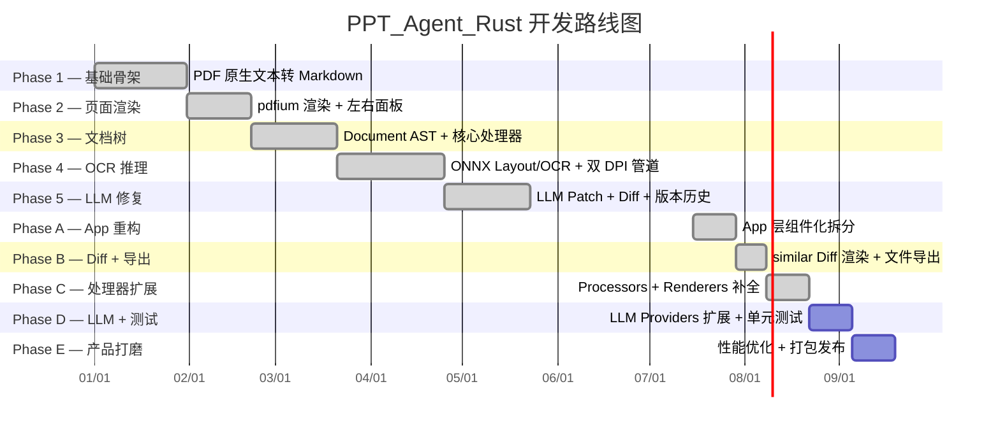

# PPT_Agent_Rust Development Roadmap

> 版本 1.0 · 2026-07-15
> 基于 execution_plan.md §25 与实际代码审计

---

## 里程碑总览

---

## Phase 1：纯 PDF 原生文本转 Markdown ✅ 已完成

**目标**：用户导入 PDF，直接提取原生字符文本，生成最基础的 Markdown。

| 交付物 | 状态 |
|--------|------|
| `pdf_agent_app` 骨架 (main.rs, app.rs, message.rs) | ✅ |
| `pdf_agent_core` 纯文本 Pipeline (TextDocumentBuilder → MarkdownRenderer) | ✅ |
| `pdf_agent_pdf` 文件读取 (lopdf native text extraction) | ✅ |
| `pdf_agent_storage` 数据存储 (SQLite schema, DbConnection) | ✅ |
| 根目录 Cargo Workspace 配置 | ✅ |

---

## Phase 2：页面渲染和比对预览 ✅ 已完成

**目标**：引入 pdfium-render 绘制 PDF 图像，实现 iced 左右面板和页码切换。

| 交付物 | 状态 |
|--------|------|
| `pdfium_backend.rs` + `page_render.rs` | ✅ |
| 左侧 PDF 渲染面板 (main_tab.rs) | ✅ |
| 右侧 Markdown 显示面板 | ✅ |
| 页码切换 (Prev / Next) | ✅ |
| 页面图片异步加载 (tokio::spawn_blocking) | ✅ |

---

## Phase 3：文档树和核心处理器 ✅ 已完成

**目标**：实现完整的 Document → Page → Block 文档树和核心处理器。

| 交付物 | 状态 |
|--------|------|
| `schema/` 完整数据模型 (Document, Page, Block, Line, Span, Char, BBox, BlockType) | ✅ |
| `LineMergeProcessor` — 相邻文本行合并 | ✅ |
| `ListProcessor` — 列表项检测与归并 | ✅ |
| `TableProcessor` — 表格块格式化 | ✅ |
| `HeadingProcessor` — 标题级别推断 | ✅ |

---

## Phase 4：OCR 推理与 Layout 检测 ✅ 已完成

**目标**：引入 pdf_agent_inference 模块，ONNX 模型接口和 OCR 降级逻辑。

| 交付物 | 状态 |
|--------|------|
| `pdf_agent_inference` crate 骨架 | ✅ |
| `LayoutPredictor` (LayoutProvider trait 实现, Stub) | ✅ |
| `OcrPredictor` (OcrProvider trait 实现, Stub) | ✅ |
| `OcrService` / `LayoutService` 包装服务 | ✅ |
| `TextDocumentBuilder` 中的 OCR 降级逻辑 | ✅ |
| UI + CLI 端注册与校验 | ✅ |

> ⚠️ 当前 LayoutPredictor 和 OcrPredictor 为 Stub 实现，返回空/mock 数据。后续需接入真实 ONNX 模型。

---

## Phase 5：LLM 局部 Patch 修复与额度配额 ✅ 已完成

**目标**：引入 pdf_agent_llm，完成反馈修复机制、Diff 预览与版本历史。

| 交付物 | 状态 |
|--------|------|
| `pdf_agent_llm` crate (MockLlmService, OpenAiLlmService) | ✅ |
| `TokenBucket` 令牌桶限流器 | ✅ |
| `LlmServiceWrapper` + ServiceRegistry 注入 | ✅ |
| `Document::find_block_with_context()` 局部上下文查找 | ✅ |
| `Document::update_block_text()` 局部更新 | ✅ |
| Block 交互式选择 UI | ✅ |
| 反馈输入框 + SubmitFeedbackClicked | ✅ |
| 版本历史 Vec + Undo/Redo | ✅ |
| Diff 模式标志 + AcceptPatch/RejectPatch | ✅ |
| `KeyringStore` 安全密钥存储 | ✅ |
| `DbConnection::increment_tokens_used` 配额记录 | ✅ |
| Settings 页面 (LLM 配置 + OCR 模式) | ✅ |

> ✅ Diff 预览已集成 `similar` 库，实现红绿行级背景色对比渲染。

---

## Phase A：App 层组件化重构 ✅ 已完成

**目标**：将 app.rs 26KB 单体文件按 execution_plan §20 拆分为组件化目录结构。

**优先级：🔴 高** — 为后续所有功能开发奠定可维护性基础。

| 任务 | 预计工作量 | 状态 |
|------|-----------|------|
| 提取 `commands/file_commands.rs` (PDF 打开/渲染) | 2h | ✅ |
| 提取 `commands/conversion_commands.rs` (转换启动) | 2h | ✅ |
| 提取 `commands/llm_commands.rs` (LLM 反馈) | 2h | ✅ |
| 提取 `commands/settings_commands.rs` (配置存储) | 1h | ✅ |
| 提取 `subscriptions/job_events.rs` (JobEventsRecipe) | 1h | ✅ |
| 创建 `panes/pdf_pane.rs` (从 main_tab 提取) | 2h | ✅ |
| 创建 `panes/markdown_pane.rs` (从 main_tab 提取) | 2h | ✅ |
| 创建 `panes/diff_pane.rs` | 2h | ✅ |
| 填充 `components/toolbar.rs` | 1h | ✅ |
| 填充 `components/feedback_box.rs` | 1h | ✅ |
| 填充 `components/progress_view.rs` | 1h | ✅ |
| 填充 `components/status_bar.rs` | 1h | ✅ |
| 提取 `update_handler.rs` (update 逻辑委托) | 1h | ✅ |
| 精简 `app.rs` 至 ~120 行骨架 | 1h | ✅ |

**验收标准**：`cargo check` 通过 ✅，功能不回退 ✅，`app.rs` < 200 行 ✅（实际 ~115 行）。

---

## Phase B：Diff 预览真实实现 + 文件导出 ✅ 已完成

**目标**：实现真正的红绿 Diff 对比视图和文件导出功能。

| 任务 | 预计工作量 | 状态 |
|------|-----------|------|
| `panes/diff_pane.rs` 集成 `similar` 库行级 diff | 3h | ✅ |
| Diff 视图红绿行背景色渲染 | 2h | ✅ |
| 导出 Markdown 到文件 (rfd SaveFileDialog) | 2h | ✅ |
| 导出 JSON (Document AST 序列化) | 1h | ✅ |
| 打开输出文件夹 (opener crate) | 1h | ✅ |
| 底部工具栏导出按钮组 | 1h | ✅ |

**验收标准**：LLM 返回补丁后显示红绿 Diff ✅，Accept/Reject 正常工作 ✅，MD/JSON 可导出到磁盘 ✅。

---

## Phase C：处理器与渲染器扩展

**目标**：补全 execution_plan 规划的 Processors 和 Renderers。

| 任务 | 优先级 | 状态 |
|------|--------|------|
| `JsonRenderer` (Output = serde_json::Value) | P1 | ✅ |
| `OrderProcessor` (阅读顺序重排) | P2 | ✅ |
| `BlockRelabelProcessor` (Block 类型二次判定) | P2 | ✅ |
| `EquationProcessor` (公式块 + LaTeX unwrap) | P2 | ✅ |
| `TocProcessor` (目录生成) | P3 | ✅ |
| `TableMergeProcessor` (跨页表格合并 + LLM 验证) | P3 | ✅ |
| `HtmlRenderer` (Output = String) | P3 | ✅ |
| `LlmSimpleMetaProcessor` (LLM 元批处理器) | P3 | ✅ |
| `DebugProcessor` (调试输出) | P3 | ✅ |

---

## Phase D：LLM Providers 扩展 + 测试

**目标**：支持多家 LLM 提供商，建立测试体系。

| 任务 | 状态 |
|------|------|
| 将 `OpenAiLlmService` 移至 `providers/openai.rs` | ☐ |
| 新增 `providers/gemini.rs` (Gemini API) | ☐ |
| 新增 `providers/ollama.rs` (本地 Ollama) | ☐ |
| 新增 `providers/anthropic.rs` (Claude API) | ☐ |
| Provider 选择器 UI (PickList / 下拉框) | ☐ |
| API Key 管理列表 (多 Key 表格 UI) | ☐ |
| 单元测试: schema 模块 (Block/Page/Document) | ☐ |
| 单元测试: processors (每个 Processor 至少 2 case) | ☐ |
| 单元测试: renderers (Markdown 快照测试) | ☐ |
| 集成测试: 端到端 PDF → Markdown (tests/fixtures/) | ☐ |

---

## Phase E：产品打磨与发布

**目标**：性能优化、跨平台打包、用户体验完善。

| 任务 | 状态 |
|------|------|
| ONNX 真实模型替换 Stub (LayoutPredictor / OcrPredictor) | ☐ |
| 模型惰性加载 + RAII Drop 释放显存 | ☐ |
| 页面缩略图缓存 + OCR 结果缓存 | ☐ |
| 双通道 DPI 管道优化 (96 DPI + 192 DPI) | ☐ |
| 页面范围转换 (All / Current / Custom) | ☐ |
| 左右面板滚动同步 | ☐ |
| 可折叠日志控制台 (tracing 集成) | ☐ |
| 智能费用预估 (转换前 Token 估算) | ☐ |
| 文件拖放 (Drag & Drop) 支持 | ☐ |
| 窗口大小记忆 + 最近打开文件 | ☐ |
| 跨平台构建脚本 (Windows / macOS / Linux) | ☐ |
| README.md 完善 (安装/使用/截图) | ☐ |

---

## 技术债清单

| 债务 | 严重度 | 所属阶段 |
|------|--------|---------|
| ~~`app.rs` 单体文件 26KB~~ → 已精简至 ~115 行 | ✅ 已清除 | Phase A |
| ~~`components/` 目录为空~~ → 含 toolbar / feedback_box / progress_view / status_bar | ✅ 已清除 | Phase A |
| ~~`panes/` 目录不存在~~ → 含 pdf_pane / markdown_pane / diff_pane | ✅ 已清除 | Phase A |
| LLM `providers/` 目录为空，适配器内联在 `service.rs` | 🟡 中 | Phase D |
| ~~Diff 预览为纯文本展示~~ → 已集成 `similar` 库 + 红绿行背景色 | ✅ 已清除 | Phase B |
| Inference Predictors 为 Stub，未接入真实 ONNX 模型 | 🟡 中 | Phase E |
| 无任何测试代码 | 🟡 中 | Phase D |
| ~~`docs/` 空壳~~ → 7 篇设计文档已完成 | ✅ 已清除 | — |
| `README.md` 仅 2 行 | 🟢 低 | Phase E |