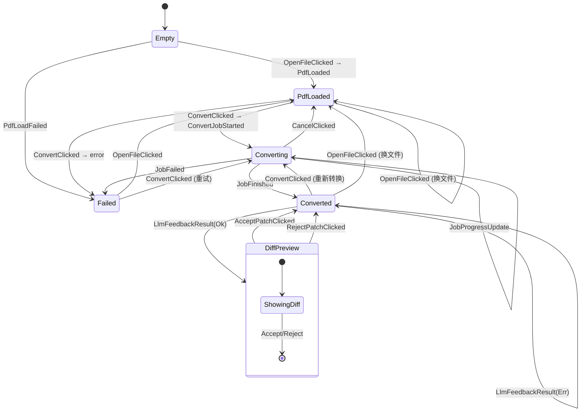
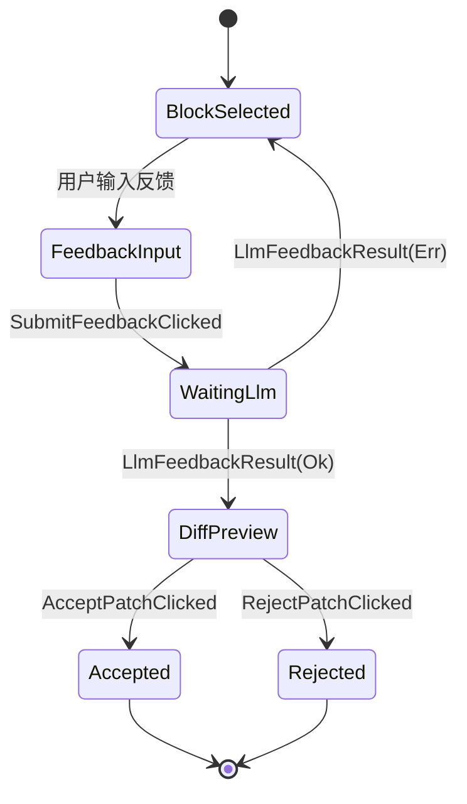
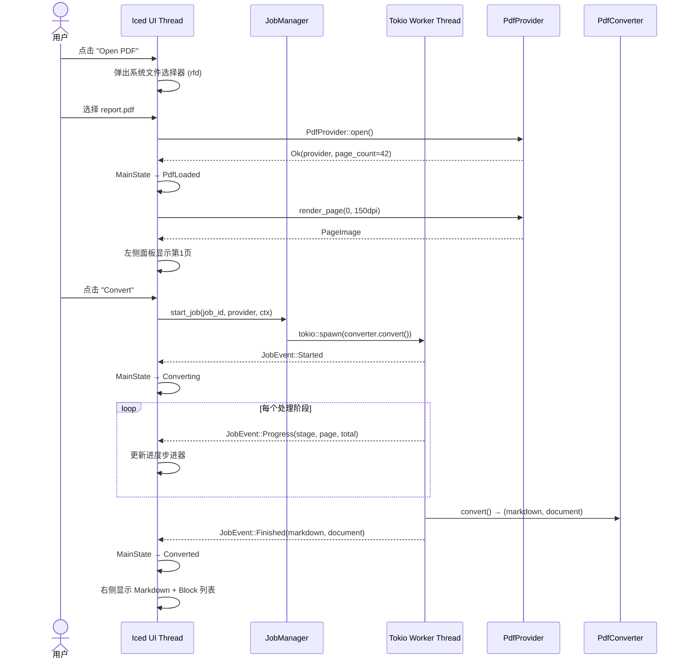
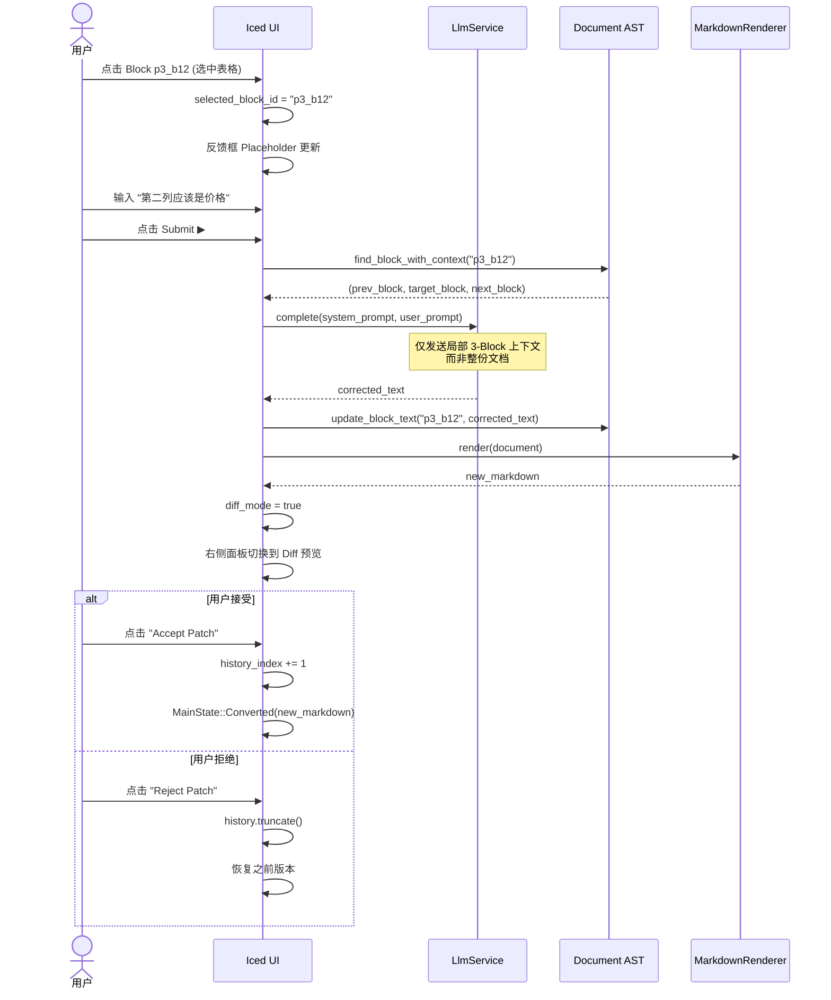
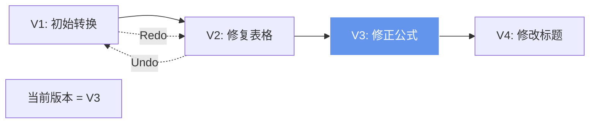

# PPT_Agent_Rust 页面与交互稿 (UI/UX Interaction Specification)

> 版本 1.0 · 2026-07-15
> 基于 execution_plan.md §13-§23 与现有代码分析

---

## 1. 设计系统 (Design System)

### 1.1 配色方案 (Dark Theme)

```text
Token             Value                    Usage
────────────────────────────────────────────────────────
background        rgb(20, 20, 26)          窗口底色
surface           rgb(30, 30, 38)          卡片/面板底色
surface-elevated  rgb(38, 38, 48)          浮层/下拉/弹窗
primary           rgb(100, 149, 237)       主按钮/活跃态
primary-hover     rgb(120, 165, 245)       主按钮悬停
success           rgb(46, 204, 113)        成功/完成标识
warning           rgb(243, 156, 18)        警告/限流提示
danger            rgb(231, 76, 60)         错误/失败标识
text              rgb(242, 242, 250)       主文本
text-muted        rgb(153, 153, 166)       次要文本/标签
border            rgb(51, 51, 64)          分隔线/边框
```

### 1.2 字体规范

| 用途     | 字体           | 大小   | 字重      |
| -------- | -------------- | ------ | --------- |
| 窗口标题 | System Default | 14px   | Bold      |
| 页面标题 | Inter / System | 28px   | Bold      |
| 区域标题 | Inter / System | 20px   | Bold      |
| 正文     | Inter / System | 14px   | Regular   |
| 代码     | JetBrains Mono | 13px   | Regular   |
| 标签     | Inter / System | 12px   | Medium    |
| 按钮     | Inter / System | 14px   | SemiBold  |

### 1.3 组件设计令牌

```text
Spacing:  xs=4  sm=8  md=12  lg=16  xl=24  2xl=32
Radius:   button=6  card=8  modal=12  input=6
Shadow:   elevated="0 4px 12px rgba(0,0,0,0.3)"
Transition: default=150ms ease-out
```

---

## 2. 窗口与全局布局 (Window & Global Layout)

### 2.1 窗口规格

```text
启动尺寸: 屏幕宽度 × 66%, 屏幕高度 × 66%
最小尺寸: 1024 × 640
居中显示
标题栏: "PPT_Agent_Rust - PDF to Markdown Converter"
```

### 2.2 全局布局结构

```text
┌─────────────────────────────────────────────────────────────┐
│ [A] 顶部导航栏 (Tab Bar)           高度: 48px               │
├─────────────────────────────────────────────────────────────┤
│                                                             │
│ [B] 内容区域 (Tab Content)          flex-grow: 1             │
│                                                             │
├─────────────────────────────────────────────────────────────┤
│ [C] 底部状态栏 (Status Bar)         高度: 28px               │
└─────────────────────────────────────────────────────────────┘
```

### 2.3 顶部导航栏 (Tab Bar)

```text
┌─────────────────────────────────────────────────────────────┐
│ 🔧 [Workspace]   [Settings]                    [▼ ℹ About] │
└─────────────────────────────────────────────────────────────┘
      active-tab       inactive-tab                 右侧菜单
      underline=primary text=text-muted
```

- 切换 Tab 时使用渐变过渡动画 (150ms fade)
- 当前激活 Tab 底部显示 2px primary 色下划线

### 2.4 底部状态栏 (Status Bar)

```text
┌─────────────────────────────────────────────────────────────┐
│ ● Ready  │ OCR: Auto  │ Output: Markdown  │ Quota: 12k/50k │
└─────────────────────────────────────────────────────────────┘
  状态指示灯    OCR模式      输出格式          当日Token消耗
  ● green=就绪
  ● blue=转换中(脉冲动画)
  ● red=失败
```

---

## 3. Workspace Tab — 主工作区 (Main Tab)

### 3.1 整体布局

```text
┌─────────────────────────────────────────────────────────────┐
│ Tab Bar                                                      │
├────────────────┬──────────────────────┬─────────────────────┤
│ [D] 状态信息栏 │                      │                     │
│    (Info Bar)  │   全宽, 高度: 36px    │                     │
├────────────────┴──────────────────────┴─────────────────────┤
│                        │                                     │
│  [E] PDF 预览面板       │  [F] Markdown / 文档面板             │
│      (Left Pane)       │      (Right Pane)                   │
│      flex: 1           │      flex: 1                        │
│                        │                                     │
│                        │                                     │
│                        │                                     │
├────────────────────────┴─────────────────────────────────────┤
│ [G] 工具栏 + 反馈输入区  (Bottom Toolbar)      高度: 52px      │
└──────────────────────────────────────────────────────────────┘
```

### 3.2 状态信息栏 [D] (Info Bar)

根据 `MainState` 枚举动态渲染内容：

| MainState    | Info Bar 内容                                                        |
| ------------ | -------------------------------------------------------------------- |
| `Empty`      | 灰色文字 "请拖入 PDF 或点击 Open PDF 开始"                               |
| `PdfLoaded`  | `📄 report.pdf · 2.3MB · 42 pages · Loaded`                         |
| `Converting` | `⚡ report.pdf · Stage: Layout Analysis · Page 12/42 · 8.2s`        |
| `Converted`  | `✅ report.pdf · Converted · 12.3s · Version 2/4`                   |
| `Failed`     | `❌ Error: Failed to load PDF — Invalid format` (red background)     |

### 3.3 PDF 预览面板 [E] (Left Pane)

#### 3.3.1 空状态 (Empty State)

```text
┌──────────────────────────┐
│                          │
│     ┌──────────────┐     │
│     │   📄         │     │
│     │   Drop PDF   │     │
│     │   here       │     │
│     └──────────────┘     │
│                          │
│   Drag & drop a PDF      │
│   or click "Open PDF"    │
│                          │
└──────────────────────────┘
  虚线边框 (border-dashed)
  border-color: border
  拖入时: border-color → primary, 背景加亮
```

#### 3.3.2 已加载状态 (PDF Loaded / Converted)

```text
┌──────────────────────────────┐
│ Source PDF Preview           │
│ ─────────────────────────    │
│ ┌──────────────────────────┐ │
│ │                          │ │
│ │   [PDF 页面渲染图像]      │ │
│ │   (scrollable area)      │ │
│ │                          │ │
│ └──────────────────────────┘ │
│                              │
│ [◀ Prev]  Page 3 of 42  [Next ▶] │
└──────────────────────────────┘
```

**交互规格：**

| 交互行为           | 描述                                               |
| ------------------ | -------------------------------------------------- |
| 翻页按钮           | 首页禁用 Prev，末页禁用 Next，灰色态                  |
| 页码指示器         | 当前页 / 总页数，点击弹出页码跳转输入框                 |
| 滚动               | 图片支持垂直滚动，滚轮平滑滚动                         |
| 缩放               | Ctrl+鼠标滚轮 / Pinch 缩放，默认 Fit Width            |
| 加载态             | 页面切换时显示 Skeleton + "Rendering page..." 文本     |
| 错误态             | 渲染失败时显示红色错误信息 + 重试按钮                   |

### 3.4 Markdown / 文档面板 [F] (Right Pane)

右侧面板是一个 **多视图容器**，根据 `MainState` 和交互模式动态切换：

#### 3.4.1 空状态 (MainState::Empty)

```text
┌──────────────────────────────┐
│ Markdown Output              │
│                              │
│   No document converted yet. │
│   Open a PDF and click       │
│   "Convert" to begin.        │
│                              │
└──────────────────────────────┘
```

#### 3.4.2 待转换状态 (MainState::PdfLoaded)

```text
┌──────────────────────────────┐
│ Markdown Output              │
│                              │
│ Loaded: report.pdf           │
│ Pages: 42                    │
│                              │
│ Click "Convert" to begin     │
│ extracting Markdown content. │
│                              │
└──────────────────────────────┘
```

#### 3.4.3 转换中状态 (MainState::Converting)

```text
┌──────────────────────────────┐
│ ⚡ Converting...              │
│                              │
│ ┌ ─ ─ ─ ─ ─ ─ ─ ─ ─ ─ ─ ─ │
│   Stage Progress Stepper     │
│                              │
│   ✅ Loading PDF             │
│   ✅ Layout Analysis         │
│   🔄 OCR Recognition  ←     │
│   ○  Running Processors      │
│   ○  Rendering               │
│ └ ─ ─ ─ ─ ─ ─ ─ ─ ─ ─ ─ ─ │
│                              │
│ Page: 12 / 42                │
│ Elapsed: 8.2s                │
│ ████████████░░░░░  29%       │
│                              │
│ [Cancel]                     │
└──────────────────────────────┘
```

**进度步进器 (Stage Stepper) 规格：**

| Stage 枚举值       | 显示标签          | 图标 |
| ------------------- | ----------------- | ---- |
| `LoadingPdf`        | Loading PDF       | ✅/🔄 |
| `LayoutAnalysis`    | Layout Analysis   | ✅/🔄 |
| `Ocr`               | OCR Recognition   | ✅/🔄 |
| `RunningProcessors` | Running Processors| ✅/🔄 |
| `Rendering`         | Rendering         | ✅/🔄 |

#### 3.4.4 已转换状态 — 普通预览模式 (Converted / Normal View)

```text
┌──────────────────────────────────────────────────────────┐
│ [Undo] V2/4 [Redo]          Converted Document           │
├──────────────────────┬───────────────────────────────────┤
│ Converted Markdown   │ Document Blocks (Page 3)          │
│ ──────────────────── │ ────────────────────────────────── │
│                      │                                   │
│ <!-- Page 3 -->      │ ┌─────────────────────────────┐   │
│                      │ │ [Text] Lorem ipsum dolor...  │   │
│ ## Chapter 2         │ │                      SELECT  │   │
│                      │ ├─────────────────────────────┤   │
│ Lorem ipsum dolor    │ │ [Heading2] Chapter 2         │   │
│ sit amet...          │ │                      SELECT  │   │
│                      │ ├─────────────────────────────┤   │
│ | Col1 | Col2 |      │ │ [Table] | Col1 | Col2 |...  │   │
│ |------|------|      │ │                   SELECTED ✓ │   │
│ | A    | B    |      │ └─────────────────────────────┘   │
│                      │                                   │
│ (scrollable)         │ (scrollable)                      │
└──────────────────────┴───────────────────────────────────┘
```

**Block 列表交互规格：**

| 交互行为     | 描述                                                     |
| ------------ | -------------------------------------------------------- |
| 点击 Block   | 切换选中状态，按钮文字变为 "SELECTED ✓"                      |
| 再次点击     | 取消选中                                                  |
| 选中高亮     | 选中 Block 的边框变为 primary 色，背景加亮                   |
| 滚动同步     | 左侧 PDF 面板翻页时，右侧自动滚动到对应页面 Block            |
| Block 预览   | 截取前 80 字符 + "..." 显示，换行符替换为空格                 |

#### 3.4.5 已转换状态 — Diff 预览模式 (Converted / Diff View)

当 LLM 反馈返回补丁后自动进入此模式：

```text
┌──────────────────────────────────────────────────────────┐
│ 🔀 Proposed LLM Patch (Diff Preview)    [Undo] V3/4 [Redo] │
├──────────────────────────────────────────────────────────┤
│                                                          │
│ ┌─ Diff View ──────────────────────────────────────────┐ │
│ │                                                      │ │
│ │ - | Price | ~~Quantiti~~ |  ← 删除行 (红色背景)       │ │
│ │ + | Price | Quantity     |  ← 新增行 (绿色背景)       │ │
│ │   | $100  | 42           |  ← 未变行 (无背景)        │ │
│ │                                                      │ │
│ └──────────────────────────────────────────────────────┘ │
│                                                          │
│ [✅ Accept Patch]  [❌ Reject Patch]  [🔄 Regenerate]     │
│                                                          │
└──────────────────────────────────────────────────────────┘
```

**Diff 视图颜色规格：**

| 行类型   | 背景色                       | 前缀符 |
| -------- | ---------------------------- | ------ |
| 删除行   | rgba(231, 76, 60, 0.15)     | `-`    |
| 新增行   | rgba(46, 204, 113, 0.15)    | `+`    |
| 不变行   | transparent                  | ` `    |

### 3.5 底部工具栏 [G] (Bottom Toolbar)

```text
┌──────────────────────────────────────────────────────────────┐
│ [📂 Open] [⚡ Convert] [⏹ Cancel]  │  [📥 MD] [📥 JSON] [📁]│
│                                     │                        │
│ ┌─────────────────────────────────────────────────────┐      │
│ │ 💬 Select a block above to request LLM alignment... │ [▶]  │
│ └─────────────────────────────────────────────────────┘      │
└──────────────────────────────────────────────────────────────┘
  左侧操作区           分隔线│        右侧导出区
                         底部反馈输入框
```

**按钮状态矩阵：**

| 按钮       | Empty        | PdfLoaded    | Converting   | Converted    | Failed       |
| ---------- | ------------ | ------------ | ------------ | ------------ | ------------ |
| Open PDF   | ✅ 可点击     | ✅ 可点击     | ❌ 禁用      | ✅ 可点击     | ✅ 可点击     |
| Convert    | ❌ 禁用       | ✅ 可点击     | ❌ 禁用      | ✅ 可点击     | ✅ 可点击     |
| Cancel     | ❌ 隐藏       | ❌ 隐藏      | ✅ 可点击     | ❌ 隐藏      | ❌ 隐藏      |
| Export MD  | ❌ 禁用       | ❌ 禁用      | ❌ 禁用      | ✅ 可点击     | ❌ 禁用      |
| Export JSON| ❌ 禁用       | ❌ 禁用      | ❌ 禁用      | ✅ 可点击     | ❌ 禁用      |
| Submit ▶   | ❌ 禁用       | ❌ 禁用      | ❌ 禁用      | 条件激活¹    | ❌ 禁用      |

> ¹ Submit 按钮仅在 `selected_block_id.is_some() && !feedback_input.is_empty()` 时激活

**反馈输入框 (Feedback Box) 交互：**

| 交互行为             | 描述                                               |
| -------------------- | -------------------------------------------------- |
| 未选择 Block         | Placeholder: "Select a block above to request..."  |
| 已选择 Block         | Placeholder: "Feedback on Block (ID: p3_b12)..."   |
| 提交成功             | 清空输入框，右侧面板进入 Diff 预览模式                |
| 提交失败             | 底部弹出红色 Toast 提示错误信息，3 秒自动消失          |
| 正在等待 LLM 返回    | Submit 按钮显示 Spinner + "Sending..."               |

---

## 4. Settings Tab — 设置页面

### 4.1 整体布局

```text
┌──────────────────────────────────────────────────────────┐
│ Settings                                                  │
├──────────────────────────────────────────────────────────┤
│                                                          │
│ ┌─ LLM Configuration ─────────────────────────────────┐  │
│ │                                                     │  │
│ │ Provider:      [▼ mock / openai / gemini / ollama ] │  │
│ │ Model Name:    [gpt-4o-mini                       ] │  │
│ │ API Base URL:  [https://api.openai.com/v1         ] │  │
│ │ API Key:       [••••••••••••••       ] [👁] [Test] │  │
│ │ Daily Limit:   [50000                             ] │  │
│ │ Temperature:   [0.2                               ] │  │
│ │ Max Retry:     [3                                 ] │  │
│ │ Timeout (ms):  [30000                             ] │  │
│ │                                                     │  │
│ └─────────────────────────────────────────────────────┘  │
│                                                          │
│ ┌─ API Key Management ────────────────────────────────┐  │
│ │                                                     │  │
│ │ Provider │ Alias │ Model     │ Status │ Actions     │  │
│ │ ─────────┼───────┼───────────┼────────┼──────────── │  │
│ │ OpenAI   │ main  │ gpt-4o   │ ✅ OK  │ [Test][Del] │  │
│ │ Gemini   │ free  │ pro-1.5  │ ✅ OK  │ [Test][Del] │  │
│ │ Ollama   │ local │ llama3   │ 🟡 Local│[Test][Del] │  │
│ │                                                     │  │
│ │ [+ Add New Key]                                     │  │
│ └─────────────────────────────────────────────────────┘  │
│                                                          │
│ ┌─ OCR Engine Settings ───────────────────────────────┐  │
│ │                                                     │  │
│ │ OCR Mode:  (●) Auto  (○) Always  (○) Never         │  │
│ │                                                     │  │
│ └─────────────────────────────────────────────────────┘  │
│                                                          │
│ ┌─ Output Settings ───────────────────────────────────┐  │
│ │                                                     │  │
│ │ Format:  [✓] Markdown  [✓] JSON  [ ] HTML           │  │
│ │ Page Range: (●) All  (○) Current  (○) Custom [1-5] │  │
│ │                                                     │  │
│ └─────────────────────────────────────────────────────┘  │
│                                                          │
│ [💾 Save Settings]  [↩ Reset to Defaults]                │
│                                                          │
└──────────────────────────────────────────────────────────┘
```

### 4.2 Settings 交互规格

| 交互行为           | 描述                                                     |
| ------------------ | -------------------------------------------------------- |
| Provider 下拉      | 选择后自动加载对应的默认 Base URL                           |
| API Key 显隐       | 默认密码模式，点击 👁 切换明文显示                           |
| Test 按钮          | 发送一次最小 Token 请求，成功显示 ✅ OK / 失败显示 ❌ Error  |
| Save Settings      | 将 API Key 写入系统 Keyring，其余配置序列化到 settings.toml |
| Reset to Defaults  | 弹出确认对话框，确认后恢复所有默认值                         |

---

## 5. 状态机与状态转换图

### 5.1 应用主状态机 (MainState)



### 5.2 Diff 预览子状态



---

## 6. 页面交互流程 (User Flows)

### 6.1 核心转换流程



### 6.2 LLM 局部修复流程



### 6.3 版本历史与撤销重做



**历史栈规格：**
- 最大深度: 20 版本 (VecDeque)
- 每个版本存储: `(Document, String)` — 文档 AST + Markdown 快照
- Undo 不删除历史，仅移动 `history_index`
- 新增补丁时 truncate `history_index` 之后的记录

---

## 7. 微交互与动画规格 (Micro-Interactions)

| 交互             | 动画类型             | 时长    | 缓动函数    |
| ---------------- | -------------------- | ------- | ----------- |
| Tab 切换         | 内容淡入淡出          | 150ms   | ease-out    |
| 按钮悬停         | 背景色加亮            | 100ms   | ease-in-out |
| 按钮点击         | 缩放 scale(0.97)     | 50ms    | ease-out    |
| 进度条填充       | 宽度渐变             | 300ms   | ease-out    |
| Block 选中       | 边框颜色过渡          | 150ms   | ease-out    |
| Toast 弹出       | 底部滑入 + 淡入       | 200ms   | ease-out    |
| Toast 消失       | 底部滑出 + 淡出       | 200ms   | ease-in     |
| 转换中脉冲       | 状态灯 opacity 脉冲   | 1.5s    | ease-in-out |
| Diff 行高亮      | 背景色渐显            | 200ms   | ease-out    |
| 页面图片加载     | Skeleton 闪烁        | 1.2s    | linear      |

---

## 8. 响应式与异常处理

### 8.1 窗口调整适配

| 窗口宽度       | 布局调整                                          |
| -------------- | ------------------------------------------------- |
| ≥ 1280px       | 标准双栏 50/50 分割                                |
| 1024-1279px    | 双栏 40/60 分割（PDF 面板收窄）                     |
| < 1024px       | 单栏模式，PDF 和 Markdown 切换显示 (Tab 切换)       |

### 8.2 异常处理 UI 规格

| 异常类型              | UI 处理方式                                          |
| --------------------- | ---------------------------------------------------- |
| PDF 文件损坏          | Failed 状态 + 红色错误横幅 + "重试" 按钮               |
| OCR 模型加载失败      | Warning Toast + 自动降级到纯文本提取                   |
| LLM API 调用失败      | Toast "LLM Error: ..." + 反馈框保留用户输入            |
| 每日 Token 配额耗尽    | 阻断弹窗 "Daily quota exceeded (50000 tokens)"        |
| 网络超时              | Toast + "重试" 按钮                                   |
| 文件导出失败          | Toast "Export failed: permission denied"              |
