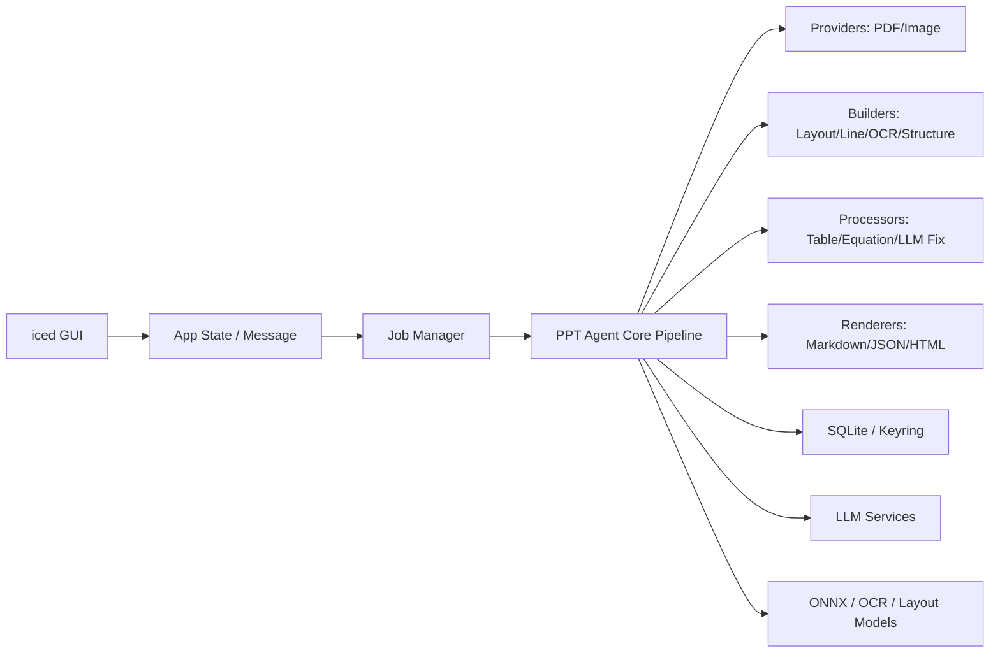

# PPT_Agent_Rust 最终执行计划 (Execution Plan)

结论：**建议做成 Cargo Workspace + 分层管道架构 + iced 作为纯 UI 壳层**。
不要把 PDF 解析、OCR、LLM、渲染逻辑直接写在 iced 的 `update/view` 里。Marker 的核心是 `Providers -> Builders -> Processors -> Renderers -> Extractors -> Services` 这种流水线结构，且具有 Document/Page/Block/Line/Span/Char 这样的文档树模型，所以 Rust 版本也应该围绕“文档转换引擎”来组织，而不是围绕界面来组织。

---

## 第一部分：总体架构与核心模块设计

### 1. 推荐总体架构



最适合的架构是：

> **iced 桌面端 + 独立 Core Engine + Pipeline 插件式处理模块 + 后台任务队列**

也可以理解成：

```text
GUI 只负责展示和交互
Core 只负责转换流程
PDF 模块只负责读取和渲染 PDF
Inference 模块只负责本地模型推理
LLM 模块只负责 API 调用
Storage 模块只负责本地数据库和密钥
```

---

### 2. 不建议的架构

#### 不建议 1：单 crate 全部塞进 `src/`

例如：

```text
src/
├─ main.rs
├─ pdf.rs
├─ ocr.rs
├─ ui.rs
├─ llm.rs
└─ db.rs
```

这个前期看起来简单，但后面会变成灾难。因为 PDF 转换会涉及 PDF 渲染、OCR、版面分析、表格处理、LLM、缓存、任务取消、进度回调、导出结果，全部放在一个 crate 里会很难维护。

#### 不建议 2：一上来拆成多个独立仓库

现在没必要单独建很多仓库。先使用 **一个仓库 + Cargo Workspace**。这样既能隔离模块，又不会增加仓库管理成本。

---

### 3. 推荐项目结构

项目名：

```text
PPT_Agent_Rust/
```

建议目录：

```text
PPT_Agent_Rust/
├─ Cargo.toml
├─ README.md
├─ LICENSE
├─ .gitignore
├─ rust-toolchain.toml
├─ docs/
│  ├─ architecture.md
│  ├─ pipeline.md
│  ├─ data-model.md
│  └─ roadmap.md
│
├─ assets/
│  ├─ icons/
│  ├─ fonts/
│  └─ sample/
│
├─ models/
│  ├─ README.md
│  ├─ layout/
│  ├─ detection/
│  ├─ ocr_error/
│  └─ recognition/
│
├─ migrations/
│  ├─ 0001_init.sql
│  └─ 0002_jobs.sql
│
├─ crates/
│  ├─ pdf_agent_app/
│  ├─ pdf_agent_core/
│  ├─ pdf_agent_pdf/
│  ├─ pdf_agent_inference/
│  ├─ pdf_agent_llm/
│  ├─ pdf_agent_storage/
│  └─ pdf_agent_cli/
│
└─ tests/
   ├─ fixtures/
   │  ├─ simple_text.pdf
   │  ├─ scanned.pdf
   │  ├─ table.pdf
   │  └─ equation.pdf
   └─ snapshots/
```

---

### 4. 根目录文件

#### `Cargo.toml`

根目录只做 workspace 管理：

```toml
[workspace]
resolver = "2"
members = [
    "crates/pdf_agent_app",
    "crates/pdf_agent_core",
    "crates/pdf_agent_pdf",
    "crates/pdf_agent_inference",
    "crates/pdf_agent_llm",
    "crates/pdf_agent_storage",
    "crates/pdf_agent_cli",
]

[workspace.dependencies]
# 在这里声明共享依赖，各 crate 用 { workspace = true } 引用
# 例如：
# serde = { version = "1", features = ["derive"] }
# tokio = { version = "1", features = ["full"] }
# thiserror = "2"
# anyhow = "1"
```

#### `README.md`

放项目介绍、运行方式、功能说明：

```md
# PPT_Agent_Rust

A Rust + iced desktop application for converting PDF files into Markdown/JSON with optional OCR and LLM enhancement.
```

#### `docs/`

放设计文档，不要混在代码里。

```text
docs/
├─ architecture.md    # 总体架构
├─ pipeline.md        # PDF 转换流水线
├─ data-model.md      # Document/Page/Block 数据结构
└─ roadmap.md         # 开发路线
```

#### `models/`

放本地模型文件或模型下载说明。不要直接把大模型文件提交到 Git。

```text
models/
├─ README.md
├─ layout/
├─ detection/
├─ ocr_error/
└─ recognition/
```

---

### 5. `crates/pdf_agent_core`：核心转换引擎

这是整个项目最重要的 crate。

```text
crates/pdf_agent_core/
├─ Cargo.toml
└─ src/
   ├─ lib.rs
   ├─ error.rs
   ├─ config/
   │  ├─ mod.rs
   │  ├─ app_config.rs
   │  ├─ pipeline_config.rs
   │  └─ model_config.rs
   ├─ context/
   │  ├─ mod.rs
   │  ├─ pipeline_context.rs
   │  └─ service_registry.rs
   ├─ schema/
   │  ├─ mod.rs
   │  ├─ document.rs
   │  ├─ page.rs
   │  ├─ block.rs
   │  ├─ block_type.rs
   │  ├─ line.rs
   │  ├─ span.rs
   │  ├─ char.rs
   │  ├─ bbox.rs
   │  ├─ table.rs
   │  └─ equation.rs
   ├─ pipeline/
   │  ├─ mod.rs
   │  ├─ converter.rs
   │  ├─ stage.rs
   │  ├─ job.rs
   │  ├─ job_event.rs
   │  └─ cancel_token.rs
   ├─ providers/
   │  ├─ mod.rs
   │  └─ traits.rs
   ├─ builders/
   │  ├─ mod.rs
   │  ├─ document_builder.rs
   │  ├─ layout_builder.rs
   │  ├─ line_builder.rs
   │  ├─ ocr_builder.rs
   │  └─ structure_builder.rs
   ├─ processors/
   │  ├─ mod.rs
   │  ├─ traits.rs
   │  ├─ order_processor.rs
   │  ├─ line_merge_processor.rs
   │  ├─ block_relabel_processor.rs
   │  ├─ table_processor.rs
   │  ├─ table_merge_processor.rs
   │  ├─ equation_processor.rs
   │  ├─ list_processor.rs
   │  ├─ toc_processor.rs
   │  ├─ llm_simple_meta_processor.rs
   │  └─ debug_processor.rs
   ├─ renderers/
   │  ├─ mod.rs
   │  ├─ traits.rs
   │  ├─ markdown_renderer.rs
   │  ├─ json_renderer.rs
   │  └─ html_renderer.rs
   ├─ extractors/
   │  ├─ mod.rs
   │  ├─ traits.rs
   │  └─ schema_extractor.rs
   └─ runtime/
      ├─ mod.rs
      ├─ job_manager.rs
      ├─ worker_pool.rs
      └─ progress_reporter.rs
```

#### 这里放什么？

##### `schema/`

放文档树结构。对应 `Document -> Page -> Layout Block -> Line -> Span -> Char`。这个是整个转换系统的中间表示，不依赖 iced，也不依赖具体 PDF 库。

##### `pipeline/`

放转换流程控制。核心文件是 `converter.rs`。它负责串起 `Provider -> Builder -> Processor -> Renderer`。

可以设计成：

```rust
pub struct PdfConverter {
    processors: Vec<Box<dyn DocumentProcessor>>,
}

impl PdfConverter {
    pub async fn convert(&self, input: ConvertInput) -> Result<ConvertOutput> {
        // 1. provider read
        // 2. document build
        // 3. processors
        // 4. renderer
    }
}
```

##### `context/`

放 `PipelineContext` 和 `ServiceRegistry`。这是 Rust 里替代 Python 动态依赖注入的地方，采用 `Context + Registry + Trait` 实现类型安全的依赖注入。

##### `builders/`

对应 Marker 的 Builders 阶段。包括：`document_builder.rs`、`layout_builder.rs`、`line_builder.rs`、`ocr_builder.rs`、`structure_builder.rs`。每个 builder 只做一件事。

##### `processors/`

对应 Marker 的串行处理器。MVP 可以先实现：`order_processor.rs`、`line_merge_processor.rs`、`table_processor.rs`、`equation_processor.rs`、`list_processor.rs`、`debug_processor.rs`。

##### `renderers/`

负责输出 Markdown、JSON、HTML 等格式。MVP 先做 `markdown_renderer.rs` 和 `json_renderer.rs`。

---

### 6. `crates/pdf_agent_pdf`：PDF 读取与渲染

这个 crate 只处理 PDF 物理层。

```text
crates/pdf_agent_pdf/
├─ Cargo.toml
└─ src/
   ├─ lib.rs
   ├─ error.rs
   ├─ pdf_provider.rs
   ├─ pdfium_backend.rs
   ├─ native_text.rs
   ├─ page_render.rs
   ├─ page_image.rs
   ├─ page_cache.rs
   ├─ coordinates.rs
   └─ text_normalizer.rs
```

#### 这里放什么？

##### `pdf_provider.rs`

实现 core 里的 Provider trait。负责读取 PDF、获取页数、提取页面尺寸、提取原生文本、提取字符坐标、渲染页面图片。

##### `pdfium_backend.rs`

封装 `pdfium-render`，确保其他模块不直接依赖 PDFium 原始 API。

##### `native_text.rs`

负责原生文本提取逻辑。

##### `page_render.rs`

负责页面渲染。例如：96 DPI 低清页面图（用于 Layout 检测）、192 DPI OCR 局部图（用于 OCR）、页面缩略图。

##### `coordinates.rs`

PDF 坐标（原点在左下角）与屏幕/图像坐标（原点在左上角）转换助手。

---

### 7. `crates/pdf_agent_inference`：本地模型推理

```text
crates/pdf_agent_inference/
├─ Cargo.toml
└─ src/
   ├─ lib.rs
   ├─ error.rs
   ├─ model_manager.rs
   ├─ ort_session.rs
   ├─ tensor.rs
   ├─ image_preprocess.rs
   ├─ predictors/
   │  ├─ mod.rs
   │  ├─ layout_predictor.rs
   │  ├─ detection_predictor.rs
   │  ├─ ocr_error_predictor.rs
   │  └─ recognition_predictor.rs
   └─ types/
      ├─ mod.rs
      ├─ layout_box.rs
      ├─ detection_box.rs
      └─ recognition_result.rs
```

#### 这里放什么？

这个 crate 专门处理：ONNX Runtime 会话、模型加载/缓存、图片预处理、Layout 检测、OCR 错误检测、文字识别以及公式识别。

关键设计：启动时不要加载所有模型。Layout/Detection 优先加载，而 Recognition/OCR 模型采用**懒加载/按需加载**，并在使用后及时 Drop 释放显存/内存。

---

### 8. `crates/pdf_agent_llm`：LLM 服务层

```text
crates/pdf_agent_llm/
├─ Cargo.toml
└─ src/
   ├─ lib.rs
   ├─ error.rs
   ├─ service.rs
   ├─ request.rs
   ├─ response.rs
   ├─ prompt/
   │  ├─ mod.rs
   │  ├─ table_merge_prompt.rs
   │  ├─ math_fix_prompt.rs
   │  ├─ text_rewrite_prompt.rs
   │  └─ schema_extract_prompt.rs
   ├─ providers/
   │  ├─ mod.rs
   │  ├─ openai.rs
   │  ├─ gemini.rs
   │  ├─ anthropic.rs
   │  └─ ollama.rs
   ├─ rate_limit/
   │  ├─ mod.rs
   │  └─ token_bucket.rs
   └─ retry.rs
```

#### 这里放什么？

负责 LLM 请求适配。包括：OpenAI/Gemini/Claude/Ollama 适配器、API Key 读取（限流/重试）、JSON 输出解析、多模态图片打包、Prompt 模板。

`processors/` 应该通过依赖注入的 `LlmService` trait 调用此服务，不要直接发起 HTTP 请求。

---

### 9. `crates/pdf_agent_storage`：本地存储

```text
crates/pdf_agent_storage/
├─ Cargo.toml
└─ src/
   ├─ lib.rs
   ├─ error.rs
   ├─ db.rs
   ├─ migrations.rs
   ├─ keyring_store.rs
   ├─ repositories/
   │  ├─ mod.rs
   │  ├─ job_repository.rs
   │  ├─ document_repository.rs
   │  ├─ settings_repository.rs
   │  └─ quota_repository.rs
   └─ models/
      ├─ mod.rs
      ├─ job_record.rs
      ├─ document_record.rs
      └─ settings_record.rs
```

#### 这里放什么？

持久化数据。包含：转换历史、文件路径及状态、导出结果、用户设置、模型配置以及 API 额度消耗。

**安全要求**：API Key 绝对不能明文存在 SQLite 数据库中，必须通过系统安全密钥环（`keyring-rs`）加密存储。SQLite 仅存储密钥别名和元数据。

---

### 10. `crates/pdf_agent_cli`：可选命令行工具

```text
crates/pdf_agent_cli/
├─ Cargo.toml
└─ src/
   └─ main.rs
```

#### 用途

用于调试转换引擎、批量转换 PDF 或是做性能测试，绕过 GUI 模块直接测试 Core。

```bash
pdf-agent convert input.pdf --output output.md
```

---

### 11. 各模块依赖关系

建议依赖方向：

```text
pdf_agent_app
    -> pdf_agent_core
    -> pdf_agent_storage

pdf_agent_core
    -> pdf_agent_pdf
    -> pdf_agent_inference
    -> pdf_agent_llm

pdf_agent_pdf
    -> 不依赖 app

pdf_agent_inference
    -> 不依赖 app

pdf_agent_llm
    -> 不依赖 app

pdf_agent_storage
    -> 不依赖 app

pdf_agent_cli
    -> pdf_agent_core
```

更严格一点：app 只能调用 core，core 通过 trait 调用各物理模块，底册模块严禁反向依赖 app。

---

### 12. 推荐核心 trait 设计

#### Provider trait

```rust
pub trait DocumentProvider {
    fn page_count(&self) -> Result<usize>;
    fn load_page(&self, page_index: usize) -> Result<PageSource>;
    fn render_page(&self, page_index: usize, dpi: u32) -> Result<PageImage>;
    fn extract_native_text(&self, page_index: usize) -> Result<Vec<NativeTextLine>>;
}
```

#### Builder trait

```rust
pub trait DocumentBuilder {
    fn build(&self, provider: &dyn DocumentProvider, ctx: &PipelineContext) -> Result<Document>;
}
```

#### Processor trait

```rust
pub trait DocumentProcessor {
    fn name(&self) -> &'static str;
    fn process(&self, document: &mut Document, ctx: &PipelineContext) -> Result<()>;
}
```

#### Renderer trait

```rust
pub trait DocumentRenderer {
    type Output;

    fn render(&self, document: &Document, ctx: &PipelineContext) -> Result<Self::Output>;
}
```

#### LLM trait

```rust
#[async_trait::async_trait]
pub trait LlmService: Send + Sync {
    async fn complete_json(&self, request: LlmRequest) -> Result<serde_json::Value>;
}
```

---

## 第二部分：UI/UX 交互设计与应用层实现

本部分设计旨在将前期的“界面草图”升级为**生产级桌面客户端**交互标准。

### 13. UI 架构与主界面建议

主界面整体方向：**左侧 PDF 原文预览，右侧 Markdown 渲染结果，底部输入修改意见，后台调用 LLM 修复结果**。这非常适合作为一个“PDF 转 Markdown 的校对工具”。

#### 界面划分

```text
┌──────────────────────────────────────────────┐
│ Tab: Main | Settings                         │
├───────────────────────┬──────────────────────┤
│                       │                      │
│ PDF Preview           │ Markdown Preview     │
│                       │                      │
│                       │                      │
├───────────────────────┴──────────────────────┤
│ [Open PDF]                                    │
│ [Convert ]  [ feedback input ..........  -> ] │
└──────────────────────────────────────────────┘
```

为了避免逻辑堆积在单个 `main_tab.rs` 中，主页面应拆分为独立组件区域：

```text
MainTab
├─ ToolbarArea            # 顶部工具栏
├─ CompareArea            # 核心比对区
│  ├─ PdfPreviewPane      # 左侧 PDF 预览面板
│  └─ MarkdownPreviewPane # 右侧 Markdown 预览面板
└─ FeedbackArea           # 底部反馈输入框与微调控制
```

---

### 14. 主页面建议加入的功能

#### 14.1 左右区域同步滚动

用户在比对 PDF 和 Markdown 时，需要视线同步。建议加入：
* **页码同步与滚动同步**：拖动左侧 PDF 时，右侧自动滚动到对应 Markdown 段落；反之亦然。
* **点击跳转定位**：点击左侧 PDF 的某一页/区域，右侧自动定位到对应 Markdown block；在右侧点击 Markdown 段落，左侧 PDF 自动跳转并高亮对应区域。
* **MVP 简化方案**：左侧选择页码，右侧直接跳转到该页对应的 Markdown section。

#### 14.2 转换状态与错误提示

右侧预览区不要在转换前或转换中显示“空白”，需要提供直观的状态看板：
* **未转换状态**：提示“尚未转换，请点击 Convert 开始”。
* **转换中状态**：显示滚动进度及当前管道阶段（如 `Layout Analysis` / `OCR` / `LLM Fix`）和当前处理页数（如 `3 / 20`）。
* **转换失败状态**：展示清晰的错误原因、日志查看入口以及重新转换按钮。

#### 14.3 顶部状态栏

左右比对区上方应加入一个轻量级的状态面板，显示以下上下文元数据：
* 文件名及大小、总页数。
* 当前转换状态（已加载 / 转换中 / 转换成功 / 转换失败）。
* 转换消耗时间（如：`12.3s`）以及所使用的 LLM 配置和输出格式。

#### 14.4 底部按钮改横向工具栏

从“临时工具”向“专业应用”靠拢，底部按钮不采用上下排列，而是横向排列组合成轻量工具栏：

```text
[打开 PDF] [开始转换] [停止任务] | [导出 MD] [导出 JSON] [打开输出文件夹]
```

---

### 15. 反馈输入框建议加强

“像聊天框一样输入修改意见”是核心交互亮点。然而，若直接把整份文档丢给 LLM 重写，耗时、成本以及生成不稳定性均难以接受。必须加入**上下文绑定**。

#### 15.1 支持选中区域后反馈

在右侧 Markdown 预览中，用户可选中某段文字/表格，系统在后台隐式绑定：

```json
{
  "document_id": "doc_123",
  "page_index": 3,
  "block_id": "block_45",
  "selected_text": "原始错误的表格/文字...",
  "current_markdown": "### Table...",
  "user_feedback": "这个表格识别错了，第二列应该是价格"
}
```

LLM 仅接收该局部上下文以及修改意见，返回修复补丁（patch）进行局部更新。

#### 15.2 加入 Diff 预览

LLM 修改的结果不应当直接、悄无声息地覆盖原 Markdown。应引入 Diff 视图，让用户对比“修改前”与“修改后”，并提供：

```text
[应用修改] [拒绝修改] [重新生成]
```

#### 15.3 支持修改历史与版本回滚

防止 LLM 越修越乱。必须在内存/SQLite 中建立版本历史：
* `Version 1`: 初始转换结果。
* `Version 2`: 修复表格 1。
* `Version 3`: 修正公式 2。
* 支持标准的撤销（Undo）、重做（Redo）、回到指定历史版本和查看修改树记录。

---

### 16. 多线程设计建议 (iced 异步模式)

iced 的 UI 线程必须保持单线程、低延迟的事件驱动。**核心引擎的长耗时阻塞任务（PDF 解析、本地 ONNX 推理、HTTP LLM 请求、文件读写）必须在后台异步 Task 中执行，禁止阻塞 UI 线程。**

#### 线程协作模型

```text
UI 线程 (Iced Run Loop)
├─ 接收 Iced Message (如 OpenPdfClicked, ConvertClicked)
├─ 同步更新本地 AppState
└─ 渲染 GUI View

后台工作线程 (Tokio 异步运行时 / Worker 线程)
├─ 执行 Core 转换管道 (PDF 解析 -> OCR -> LLM API)
└─ 通过 Channel / Subscription 异步回传进度事件 `JobEvent`
```

推荐的消息传递事件流：

```text
Message::OpenFileClicked
  ↓ (Tokio 线程执行文件选择与加载)
Message::LoadPdfStarted
  ↓ 
Message::LoadPdfFinished(DocumentMeta)

Message::ConvertClicked
  ↓ (Tokio 后台执行转换管道)
Message::ConvertJobStarted(JobId)
  ↓
Message::JobProgress(Stage, CurrentPage, TotalPage)
  ↓
Message::JobFinished(MarkdownContent) / JobFailed(String)
```

---

### 17. App 状态机建议

为了确保 UI 渲染的高度确定性，防止不一致的 bool 变量交叉导致界面渲染冲突，必须使用 Rust 的 `enum` 显式描述应用主状态机：

```rust
pub enum MainState {
    Empty,
    PdfLoaded {
        file_path: PathBuf,
        page_count: usize,
    },
    Converting {
        file_path: PathBuf,
        progress: JobProgress,
    },
    Converted {
        file_path: PathBuf,
        markdown: String,
        version_id: String,
    },
    Failed {
        file_path: Option<PathBuf>,
        error: String,
    },
}
```

* `Empty` -> 展示文件拖入欢迎区。
* `PdfLoaded` -> 展示左侧 PDF 预览，右侧提示“尚未转换，请点击开始”。
* `Converting` -> 展示左侧 PDF 预览，右侧渲染带当前页码和耗时指示的进度看板。
* `Converted` -> 开启侧边栏控制，展示左右对照视图。
* `Failed` -> 弹出红色错误横幅与详细日志，并提供“重新转换”按钮。

---

### 18. 设置页分区与多 API Key 管理

#### 18.1 LLM 设置

设置页面需要支持：
* **模型参数配置**：支持 OpenAI / Gemini / Claude / Ollama 的接入选择。提供 Model Name、Base URL、Timeout、Max Retry 和 Temperature 调节。
* **安全存储**：API Key 写入本地时调用 `keyring-rs` 保存到系统 Credential Store。本地的配置文件 `settings.toml` 仅保留模型配置元信息及密钥别名。

#### 18.2 多 API Key 列表管理

以表格列表展示用户绑定的多个密钥别名，支持便捷的连接状态校验：

```text
Provider | Alias | Model | Status | Actions
OpenAI   | main  | xxx   | OK     | Test / Delete
Gemini   | free  | xxx   | OK     | Test / Delete
Ollama   | local | xxx   | Local  | Test / Delete
```

#### 18.3 智能额度预测

在转换前评估费用。本地计算 PDF 文档的页数、包含的公式与图表，给出开销估算：

```text
预计需要 OCR 页数：12 页
预计 LLM 调用：5 次
预计消耗 tokens：约 30k
```

---

### 19. 建议加入的高级功能

#### 19.1 页面范围转换

调试大文件或不想消耗过多 Token 时，支持自主选择页面转换范围：
* **转换全部**。
* **仅转换当前激活预览页**。
* **自定义页码范围**（例如：`1-5, 8, 10-12`）。

#### 19.2 OCR 开关控制

提供三种 OCR 触发机制：
* `Auto` (默认值)：核心管道尝试 native text extraction，若失败则退避调用 OCR。
* `Always`：强制渲染高 DPI 图像全部走 OCR 模块，适用于全扫描版 PDF。
* `Never`：不执行 OCR，只提取原生文本，极速省电，适合文本型 PDF。

#### 19.3 输出格式拓展

转换管道在 Renderers 阶段应具备多出口适配能力，支持导出：
* `Markdown` (主要目标)。
* `JSON` (树状结构元数据，适于二次分析)。
* `HTML` / `Plain Text`。
* `Chunks for RAG` (专为大模型向量数据库 RAG 准备的预切片格式)。

#### 19.4 日志面板

在底部或侧边提供一个可收折的控制台，打印转换过程中的 INFO、WARN 与 ERROR。在出现 OCR 失败、API 校验出错时能够让用户快速定位成因并复制日志排错。

#### 19.5 缓存机制

为避免重复做重度推理：
* 缓存已生成的 PDF 页面缩略图。
* 缓存 OCR 识别结果与 Layout 检测框，确保二次运行同一文件不重复调用 ONNX 和 LLM，提供流畅的体验。

---

### 20. 应用层 Crate 结构 (crates/pdf_agent_app)

基于全新的 UI/UX 架构，`crates/pdf_agent_app` 的完整源目录应该按组件和状态清晰拆分：

```text
crates/pdf_agent_app/
└─ src/
   ├─ main.rs                 # 应用程序入口
   ├─ app.rs                  # Iced Application 主生命周期逻辑
   ├─ message.rs              # App 统一消息总线定义
   ├─ route.rs                # Main 与 Settings 路由定义
   ├─ theme.rs                # 全局调色盘与字体样式设计
   ├─ layout.rs               # 主布局器定义
   │
   ├─ state/                  # 状态管理
   │  ├─ mod.rs
   │  ├─ app_state.rs         # 全局顶层状态
   │  ├─ main_state.rs        # 主页面状态 (MainState 绑定)
   │  ├─ settings_state.rs    # 设置页面状态
   │  └─ preview_state.rs     # 滚动和页码同步的预览状态
   │
   ├─ screens/                # Tab 页面渲染
   │  ├─ mod.rs
   │  ├─ main_tab.rs          # 转换主 Tab
   │  └─ settings_tab.rs      # 设置 Tab
   │
   ├─ panes/                  # 核心比对区面板
   │  ├─ mod.rs
   │  ├─ pdf_pane.rs          # PDF 渲染预览面板
   │  ├─ markdown_pane.rs     # Markdown 渲染与文本面板
   │  └─ diff_pane.rs         # LLM 调整前的 Diff 预览面板
   │
   ├─ components/             # 可复用组件与轻量组件
   │  ├─ mod.rs
   │  ├─ toolbar.rs           # 横向控制工具栏
   │  ├─ file_button.rs       # 打开 PDF 按钮
   │  ├─ convert_button.rs    # 转换按钮
   │  ├─ feedback_box.rs      # 绑定上下文的反馈聊天输入框
   │  ├─ provider_selector.rs # LLM 提供商选择下拉框
   │  ├─ api_key_editor.rs    # API Key 表单项
   │  ├─ progress_view.rs     # 阶段式任务进度面板
   │  └─ status_bar.rs        # 顶部状态栏
   │
   ├─ commands/               # Tokio 异步任务命令
   │  ├─ mod.rs
   │  ├─ file_commands.rs     # PDF 加载指令
   │  ├─ conversion_commands.rs # 触发转换指令
   │  ├─ llm_commands.rs      # 发送反馈与局部修改指令
   │  └─ settings_commands.rs # 读取/保存设置指令
   │
   └─ subscriptions/          # Iced 事件订阅 (异步长连接通道)
      ├─ mod.rs
      ├─ job_events.rs        # 接收后台 Job 进度事件
      └─ file_watcher.rs      # (可选) 配置文件监听
```

---

### 21. 建议的数据结构

```rust
// app 全局状态
pub struct AppState {
    pub window: WindowState,
    pub route: Route,
    pub main: MainTabState,
    pub settings: SettingsState,
}

// 主 Tab 转换和校验状态
pub struct MainTabState {
    pub file: Option<PdfFileState>,
    pub conversion: ConversionState,
    pub feedback_input: String,
    pub selected_block: Option<BlockId>,
}

// 转换任务子状态机
pub enum ConversionState {
    Idle,
    LoadingPdf,
    Ready,
    Converting(JobProgress),
    Converted(ConvertedDocument),
    ApplyingFeedback(JobProgress),
    Failed(String),
}

// 设置配置项状态
pub struct SettingsState {
    pub llm_provider: LlmProvider,
    pub model_name: String,
    pub api_keys: Vec<ApiKeyEntry>,
    pub theme: AppTheme,
    pub quota: QuotaSettings,
}
```

---

### 22. 开发者风格 App UI 规格书

#### Overview
PPT_Agent_Rust is a multi-threaded desktop application built with Rust and iced. The application provides a two-panel PDF-to-Markdown conversion workflow, allowing users to visually compare the original PDF with the rendered Markdown output.

#### Window Behavior
On startup, the application reads the current screen size and creates a centered window using approximately 66% of the screen width and height.

#### Main Layout
The application contains two primary tabs:
* **Main**
* **Settings**

##### Main Tab
The Main tab contains three main regions:
1. PDF preview pane (left)
2. Markdown preview pane (right)
3. Bottom action and feedback area

The left pane is used to render the source PDF. The right pane is used to render the converted Markdown result.
* When no PDF is loaded, both panes display an empty placeholder state.
* After a PDF file is loaded: the left pane displays the PDF content; the right pane displays a waiting state until conversion starts.
* After conversion succeeds: the right pane renders the generated Markdown; the user can compare the PDF and Markdown side by side.

##### Bottom Area
The bottom area contains:
* Open PDF button
* Convert button
* Feedback input box
* Submit feedback button

The feedback input behaves like a chat input. Users can describe conversion issues, such as incorrect tables, formulas, headings, or missing content. After submission, the backend sends the selected context and user feedback to the configured LLM provider and generates a revised Markdown patch.

##### Settings Tab
The Settings tab allows users to configure:
* LLM provider, Model name, API keys
* Base URL, Request timeout, Retry count
* App theme, OCR mode, Export format
* Token quota, Daily usage limit, Local model configuration

---

### 23. 核心改进点与局部 Patch 逻辑

1. **左右同步预览**：双滚动视口建立相对坐标绑定。
2. **转换进度状态**：以多阶段步进器展示后台 Pipeline 执行的阶段。
3. **错误提示和日志**：建立可折叠控制台抓取 `tracing` 输出。
4. **LLM 修改前的 Diff 预览**：引入 `similar` 库比对文本差异，在右侧渲染红绿对比视图。
5. **修改历史与撤销**：使用 `VecDeque` 维护内存快照队列（限制深度为 20），作为撤销/重做缓冲区。
6. **API Key 安全存储**：在存储层只保存密钥哈希和 Keyring 存储路径，直接调取本地密钥库。
7. **局部 Patch 逻辑**：当用户在 `feedback_box` 输入反馈时，后台不发送整份 Markdown。而是截取 `selected_block` 所在段落的 Markdown 源码，连同上一段、下一段作为 Context 提交给 LLM，要求 LLM 返回 JSON 格式的 `ReplacementPatch`（包括原文本、替换后文本），Core 接收到此 JSON 后仅在 Document 中替换该 `BlockId` 的节点。

---

## 第三部分：流程控制与开发顺序

### 24. 转换流程建议

```text
1. 用户拖入 PDF
2. iced 创建 ConvertJob
3. JobManager 把任务放到后台 worker
4. PdfProvider 读取 PDF
5. DocumentBuilder 构建初始 Document
6. LayoutBuilder 做版面检测
7. LineBuilder 判断使用原生文本还是 OCR
8. OcrBuilder 按需识别扫描页
9. StructureBuilder 组装文档树
10. Processors 串行修复文档 (如表格重建、列表重排、公式解包等)
11. Renderer 输出 Markdown/JSON/RAG Chunks
12. Storage 保存任务记录和转换指标
13. iced 接收到 JobEvent，刷新进度和结果
```

---

### 25. MVP 开发顺序

不要一开始就做完整 Marker。建议分阶段实施：

#### Phase 1：纯 PDF 原生文本转 Markdown [已完成]
* 包含模块：`pdf_agent_app`（骨架）、`pdf_agent_core`（纯文本）、`pdf_agent_pdf`（文件读取）、`pdf_agent_storage`（数据存储）。
* 目标：用户导入 PDF，直接提取原生字符及跨度文本，应用简单的行归并处理器，生成并导出最基础的 Markdown，暂时不渲染 PDF 图像，不引入 OCR 与 LLM。

#### Phase 2：页面渲染和比对预览 [已完成]
* 目标：引入 `pdfium-render` 绘制 PDF 图像，实现 iced 中的左侧 PDF 渲染面板和右侧 Markdown 显示面板，实现页码切换和基础的滚动跳转。

#### Phase 3：文档树和核心处理器 [已完成]
* 目标：在 `core` 模块中实现完整的 `Document -> Page -> Block` 文档树，实现 `LineMergeProcessor`、`ListProcessor` 以及初步的 `TableProcessor`，大幅度改善 Markdown 排版。

#### Phase 4：OCR 推理与 Layout 检测 [已完成]
* 目标：引入 `pdf_agent_inference` 模块，使用 `ort` 加载 Layout 目标检测和 OCR 识别模型，实现双通道双 DPI 管道，仅对扫描页或无原生文本的图表区域按需触发 OCR，输出混排文档。（已成功构建 OCR / Layout 分析提供者与服务接口，打通主构建流程中的 OCR 备用降级逻辑，在 UI 与 CLI 端分别完成实例化与注册校验，编译完全通过）。

#### Phase 5：LLM 局部 Patch 修复与额度配额 [已完成]
* 目标：引入 `pdf_agent_llm`，设计 `LlmService` 调用，完成底部 `feedback_box` 局部 Patch 修复机制，在 Iced UI 中接入 Diff 预览与版本历史回滚；补充 Token 额度和每日使用限额机制。
* 现状：已实现全部特性。LLM 模块包含 Mock 与 OpenAI 适配器以及令牌桶限流器；核心模块支持定位 Block 与局部更新；存储层可监控每日配额与安全密钥存取；Iced App 提供交互式 Block 选择、Diff 预览、版本历史撤销/重做及详细配置表单。

---

### 26. 最推荐的最终目录树

可以直接按此物理结构建立工作区：

```text
PPT_Agent_Rust/
├─ Cargo.toml
├─ README.md
├─ LICENSE
├─ .gitignore
├─ rust-toolchain.toml
│
├─ docs/
│  ├─ architecture.md
│  ├─ pipeline.md
│  ├─ data-model.md
│  └─ roadmap.md
│
├─ assets/
│  ├─ icons/
│  ├─ fonts/
│  └─ sample/
│
├─ models/
│  ├─ README.md
│  ├─ layout/
│  ├─ detection/
│  ├─ ocr_error/
│  └─ recognition/
│
├─ migrations/
│  ├─ 0001_init.sql
│  └─ 0002_jobs.sql
│
├─ crates/
│  ├─ pdf_agent_app/
│  │  ├─ Cargo.toml
│  │  └─ src/
│  │     ├─ main.rs
│  │     ├─ app.rs
│  │     ├─ message.rs
│  │     ├─ route.rs
│  │     ├─ theme.rs
│  │     ├─ layout.rs
│  │     ├─ state/
│  │     │  ├─ mod.rs
│  │     │  ├─ app_state.rs
│  │     │  ├─ main_state.rs
│  │     │  ├─ settings_state.rs
│  │     │  └─ preview_state.rs
│  │     ├─ screens/
│  │     │  ├─ mod.rs
│  │     │  ├─ main_tab.rs
│  │     │  └─ settings_tab.rs
│  │     ├─ panes/
│  │     │  ├─ mod.rs
│  │     │  ├─ pdf_pane.rs
│  │     │  ├─ markdown_pane.rs
│  │     │  └─ diff_pane.rs
│  │     ├─ components/
│  │     │  ├─ mod.rs
│  │     │  ├─ toolbar.rs
│  │     │  ├─ file_button.rs
│  │     │  ├─ convert_button.rs
│  │     │  ├─ feedback_box.rs
│  │     │  ├─ provider_selector.rs
│  │     │  ├─ api_key_editor.rs
│  │     │  ├─ progress_view.rs
│  │     │  └─ status_bar.rs
│  │     ├─ commands/
│  │     │  ├─ mod.rs
│  │     │  ├─ file_commands.rs
│  │     │  ├─ conversion_commands.rs
│  │     │  ├─ llm_commands.rs
│  │     │  └─ settings_commands.rs
│  │     └─ subscriptions/
│  │        ├─ mod.rs
│  │        ├─ job_events.rs
│  │        └─ file_watcher.rs
│  │
│  ├─ pdf_agent_core/
│  │  ├─ Cargo.toml
│  │  └─ src/
│  │     ├─ lib.rs
│  │     ├─ error.rs
│  │     ├─ config/
│  │     ├─ context/
│  │     ├─ schema/
│  │     ├─ pipeline/
│  │     ├─ providers/
│  │     ├─ builders/
│  │     ├─ processors/
│  │     ├─ renderers/
│  │     ├─ extractors/
│  │     └─ runtime/
│  │
│  ├─ pdf_agent_pdf/
│  │  ├─ Cargo.toml
│  │  └─ src/
│  │     ├─ lib.rs
│  │     ├─ error.rs
│  │     ├─ pdf_provider.rs
│  │     ├─ pdfium_backend.rs
│  │     ├─ native_text.rs
│  │     ├─ page_render.rs
│  │     ├─ page_image.rs
│  │     ├─ page_cache.rs
│  │     ├─ coordinates.rs
│  │     └─ text_normalizer.rs
│  │
│  ├─ pdf_agent_inference/
│  │  ├─ Cargo.toml
│  │  └─ src/
│  │     ├─ lib.rs
│  │     ├─ error.rs
│  │     ├─ model_manager.rs
│  │     ├─ ort_session.rs
│  │     ├─ tensor.rs
│  │     ├─ image_preprocess.rs
│  │     ├─ predictors/
│  │     └─ types/
│  │
│  ├─ pdf_agent_llm/
│  │  ├─ Cargo.toml
│  │  └─ src/
│  │     ├─ lib.rs
│  │     ├─ error.rs
│  │     ├─ service.rs
│  │     ├─ request.rs
│  │     ├─ response.rs
│  │     ├─ prompt/
│  │     ├─ providers/
│  │     ├─ rate_limit/
│  │     └─ retry.rs
│  │
│  ├─ pdf_agent_storage/
│  │  ├─ Cargo.toml
│  │  └─ src/
│  │     ├─ lib.rs
│  │     ├─ error.rs
│  │     ├─ db.rs
│  │     ├─ migrations.rs
│  │     ├─ keyring_store.rs
│  │     ├─ repositories/
│  │     └─ models/
│  │
│  └─ pdf_agent_cli/
│     ├─ Cargo.toml
│     └─ src/
│        └─ main.rs
│
└─ tests/
   ├─ fixtures/
   └─ snapshots/
```

---

### 27. 一句话总结

**PPT_Agent_Rust 最好不是“iced 项目里加 PDF 功能”，而是“PDF 转换引擎 + iced 桌面壳”。**

最核心的设计原则是：

```text
iced 负责交互
core 负责流程
pdf 负责文件
inference 负责模型
llm 负责增强
storage 负责状态
cli 负责调试
```

这样后面无论是做 OCR、LLM 表格修复、Markdown 导出、JSON 智能抽取，还是以后更换 GUI 框架，整个转换引擎核心和第三方底座都不需要推倒重来。
