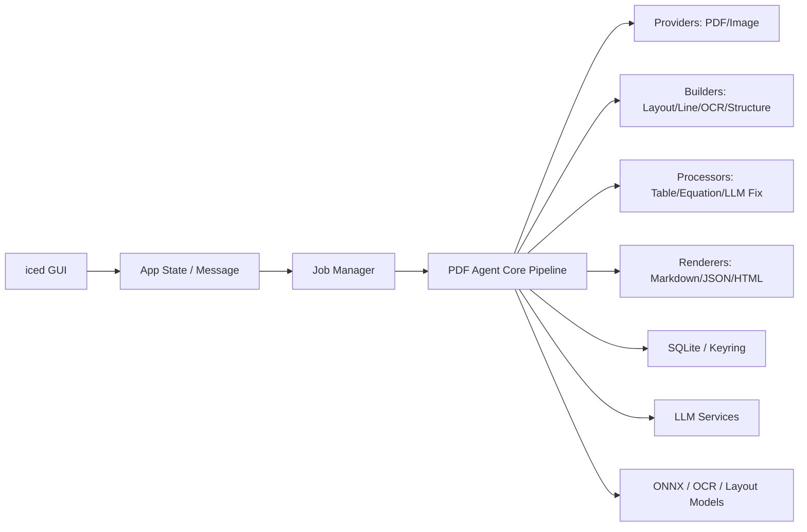

# PDF-Agent-Rust 架构建议

结论：**建议做成 Cargo Workspace + 分层管道架构 + iced 作为纯 UI 壳层**。
不要把 PDF 解析、OCR、LLM、渲染逻辑直接写在 iced 的 `update/view` 里。你的文档本身已经说明 Marker 的核心是 `Providers -> Builders -> Processors -> Renderers -> Extractors -> Services` 这种流水线结构，而且还有 Document/Page/Block/Line/Span/Char 这样的文档树模型，所以 Rust 版本也应该围绕“文档转换引擎”来组织，而不是围绕界面来组织。

---

## 1. 推荐总体架构



最适合你的架构是：

> **iced 桌面端 + 独立 Core Engine + Pipeline 插件式处理模块 + 后台任务队列**

也可以理解成：

```text
GUI 只负责展示和交互
Core 只负责转换流程
PDF 模块只负责读取和渲染 PDF
Inference 模块只负责本地模型推理
LLM 模块只负责 API 调用
Storage 模块只负责本地数据库和密钥
```

---

## 2. 不建议的架构

### 不建议 1：单 crate 全部塞进 `src/`

比如：

```text
src/
├─ main.rs
├─ pdf.rs
├─ ocr.rs
├─ ui.rs
├─ llm.rs
└─ db.rs
```

这个前期看起来简单，但后面会变成灾难。因为 PDF 转换会涉及 PDF 渲染、OCR、版面分析、表格处理、LLM、缓存、任务取消、进度回调、导出结果，全部放在一个 crate 里会很难维护。

### 不建议 2：一上来拆成多个独立仓库

现在没必要单独建很多仓库。你可以先用 **一个仓库 + Cargo Workspace**。这样既能隔离模块，又不会增加仓库管理成本。

---

## 3. 推荐项目结构

项目名：

```text
PDF-Agent-Rust/
```

建议目录：

```text
PDF-Agent-Rust/
├─ Cargo.toml
├─ README.md
├─ LICENSE
├─ .gitignore
├─ rust-toolchain.toml
├─ docs/
│  ├─ architecture.md
│  ├─ pipeline.md
│  ├─ data-model.md
│  └─ roadmap.md
│
├─ assets/
│  ├─ icons/
│  ├─ fonts/
│  └─ sample/
│
├─ models/
│  ├─ README.md
│  ├─ layout/
│  ├─ detection/
│  ├─ ocr_error/
│  └─ recognition/
│
├─ migrations/
│  ├─ 0001_init.sql
│  └─ 0002_jobs.sql
│
├─ crates/
│  ├─ pdf_agent_app/
│  ├─ pdf_agent_core/
│  ├─ pdf_agent_pdf/
│  ├─ pdf_agent_inference/
│  ├─ pdf_agent_llm/
│  ├─ pdf_agent_storage/
│  └─ pdf_agent_cli/
│
└─ tests/
   ├─ fixtures/
   │  ├─ simple_text.pdf
   │  ├─ scanned.pdf
   │  ├─ table.pdf
   │  └─ equation.pdf
   └─ snapshots/
```

---

## 4. 根目录文件

### `Cargo.toml`

根目录只做 workspace 管理：

```toml
[workspace]
resolver = "2"
members = [
    "crates/pdf_agent_app",
    "crates/pdf_agent_core",
    "crates/pdf_agent_pdf",
    "crates/pdf_agent_inference",
    "crates/pdf_agent_llm",
    "crates/pdf_agent_storage",
    "crates/pdf_agent_cli",
]
```

### `README.md`

放项目介绍、运行方式、功能说明：

```md
# PDF-Agent-Rust

A Rust + iced desktop application for converting PDF files into Markdown/JSON with optional OCR and LLM enhancement.
```

### `docs/`

放设计文档，不要混在代码里。

```text
docs/
├─ architecture.md    # 总体架构
├─ pipeline.md        # PDF 转换流水线
├─ data-model.md      # Document/Page/Block 数据结构
└─ roadmap.md         # 开发路线
```

### `models/`

放本地模型文件或模型下载说明。不要直接把大模型文件提交到 Git。

```text
models/
├─ README.md
├─ layout/
├─ detection/
├─ ocr_error/
└─ recognition/
```

---

# 5. `crates/pdf_agent_app`：iced 桌面 GUI

这个 crate 只负责 UI。

```text
crates/pdf_agent_app/
├─ Cargo.toml
└─ src/
   ├─ main.rs
   ├─ app.rs
   ├─ message.rs
   ├─ route.rs
   ├─ theme.rs
   ├─ state/
   │  ├─ mod.rs
   │  ├─ app_state.rs
   │  ├─ job_state.rs
   │  └─ settings_state.rs
   ├─ screens/
   │  ├─ mod.rs
   │  ├─ home.rs
   │  ├─ import.rs
   │  ├─ convert.rs
   │  ├─ result.rs
   │  ├─ history.rs
   │  └─ settings.rs
   ├─ components/
   │  ├─ mod.rs
   │  ├─ file_drop.rs
   │  ├─ progress_bar.rs
   │  ├─ pdf_preview.rs
   │  ├─ result_panel.rs
   │  ├─ job_card.rs
   │  └─ sidebar.rs
   ├─ commands/
   │  ├─ mod.rs
   │  ├─ open_file.rs
   │  ├─ start_conversion.rs
   │  └─ export_result.rs
   └─ subscriptions/
      ├─ mod.rs
      └─ job_events.rs
```

## 这里放什么？

### `main.rs`

只负责启动 iced 应用。

```rust
fn main() -> iced::Result {
    pdf_agent_app::run()
}
```

### `app.rs`

iced 的主应用状态。

放：

```rust
pub struct PdfAgentApp {
    pub route: Route,
    pub state: AppState,
}
```

负责：

```text
update(message)
view()
subscription()
```

### `message.rs`

放所有 UI 消息。

```rust
pub enum Message {
    OpenFileClicked,
    FileSelected(PathBuf),
    StartConvert,
    JobProgress(JobProgress),
    JobFinished(JobResult),
    JobFailed(String),
    OpenSettings,
    SaveSettings,
}
```

### `screens/`

每个页面一个文件：

```text
home.rs       # 首页
import.rs     # 导入 PDF
convert.rs    # 转换进度
result.rs     # Markdown/JSON 结果展示
history.rs    # 历史任务
settings.rs   # API Key、OCR、导出设置
```

### `components/`

可复用组件：

```text
file_drop.rs       # 拖拽 PDF 文件
progress_bar.rs    # 转换进度
pdf_preview.rs     # PDF 页面预览
result_panel.rs    # Markdown/JSON 输出结果
job_card.rs        # 任务卡片
sidebar.rs         # 左侧导航
```

### `commands/`

UI 到 Core 的桥接层。
这里不要写实际转换逻辑，只负责调用 `pdf_agent_core`。

---

# 6. `crates/pdf_agent_core`：核心转换引擎

这是整个项目最重要的 crate。

```text
crates/pdf_agent_core/
├─ Cargo.toml
└─ src/
   ├─ lib.rs
   ├─ error.rs
   ├─ config/
   │  ├─ mod.rs
   │  ├─ app_config.rs
   │  ├─ pipeline_config.rs
   │  └─ model_config.rs
   ├─ context/
   │  ├─ mod.rs
   │  ├─ pipeline_context.rs
   │  └─ service_registry.rs
   ├─ schema/
   │  ├─ mod.rs
   │  ├─ document.rs
   │  ├─ page.rs
   │  ├─ block.rs
   │  ├─ block_type.rs
   │  ├─ line.rs
   │  ├─ span.rs
   │  ├─ char.rs
   │  ├─ bbox.rs
   │  ├─ table.rs
   │  └─ equation.rs
   ├─ pipeline/
   │  ├─ mod.rs
   │  ├─ converter.rs
   │  ├─ stage.rs
   │  ├─ job.rs
   │  ├─ job_event.rs
   │  └─ cancel_token.rs
   ├─ providers/
   │  ├─ mod.rs
   │  └─ traits.rs
   ├─ builders/
   │  ├─ mod.rs
   │  ├─ document_builder.rs
   │  ├─ layout_builder.rs
   │  ├─ line_builder.rs
   │  ├─ ocr_builder.rs
   │  └─ structure_builder.rs
   ├─ processors/
   │  ├─ mod.rs
   │  ├─ traits.rs
   │  ├─ order_processor.rs
   │  ├─ line_merge_processor.rs
   │  ├─ block_relabel_processor.rs
   │  ├─ table_processor.rs
   │  ├─ table_merge_processor.rs
   │  ├─ equation_processor.rs
   │  ├─ list_processor.rs
   │  ├─ toc_processor.rs
   │  ├─ llm_simple_meta_processor.rs
   │  └─ debug_processor.rs
   ├─ renderers/
   │  ├─ mod.rs
   │  ├─ traits.rs
   │  ├─ markdown_renderer.rs
   │  ├─ json_renderer.rs
   │  └─ html_renderer.rs
   ├─ extractors/
   │  ├─ mod.rs
   │  ├─ traits.rs
   │  └─ schema_extractor.rs
   └─ runtime/
      ├─ mod.rs
      ├─ job_manager.rs
      ├─ worker_pool.rs
      └─ progress_reporter.rs
```

## 这里放什么？

### `schema/`

放文档树结构。

对应文档里的：

```text
Document -> Page -> Layout Block -> Line -> Span -> Char
```

这个是整个转换系统的中间表示，不应该依赖 iced，也不应该依赖具体 PDF 库。

### `pipeline/`

放转换流程控制。

核心文件是：

```text
converter.rs
```

它负责串起：

```text
Provider -> Builder -> Processor -> Renderer
```

可以设计成：

```rust
pub struct PdfConverter {
    processors: Vec<Box<dyn DocumentProcessor>>,
}

impl PdfConverter {
    pub async fn convert(&self, input: ConvertInput) -> Result<ConvertOutput> {
        // 1. provider read
        // 2. document build
        // 3. processors
        // 4. renderer
    }
}
```

### `context/`

放 `PipelineContext` 和 `ServiceRegistry`。

这是 Rust 里替代 Python 动态依赖注入的地方。你的文档里也提到，Python Marker 使用动态依赖注入，而 Rust 更适合用 `Context + Registry + Trait` 来做。

### `builders/`

对应 Marker 的 Builders 阶段。

建议先建这些：

```text
document_builder.rs
layout_builder.rs
line_builder.rs
ocr_builder.rs
structure_builder.rs
```

每个 builder 只做一件事。

### `processors/`

对应 Marker 的 29 个串行处理器。你不用一开始就全部实现，但文件结构先按处理器拆开是对的。

MVP 可以先实现：

```text
order_processor.rs
line_merge_processor.rs
table_processor.rs
equation_processor.rs
list_processor.rs
debug_processor.rs
```

LLM 相关的后面再做。

### `renderers/`

负责输出：

```text
Markdown
JSON
HTML
Chunks
```

MVP 先做：

```text
markdown_renderer.rs
json_renderer.rs
```

---

# 7. `crates/pdf_agent_pdf`：PDF 读取与渲染

这个 crate 只处理 PDF 物理层。

```text
crates/pdf_agent_pdf/
├─ Cargo.toml
└─ src/
   ├─ lib.rs
   ├─ error.rs
   ├─ pdf_provider.rs
   ├─ pdfium_backend.rs
   ├─ native_text.rs
   ├─ page_render.rs
   ├─ page_image.rs
   ├─ page_cache.rs
   ├─ coordinates.rs
   └─ text_normalizer.rs
```

## 这里放什么？

### `pdf_provider.rs`

实现 core 里的 Provider trait。

```rust
pub struct PdfProvider {
    path: PathBuf,
}
```

负责：

```text
读取 PDF
获取页数
提取页面尺寸
提取原生文本
提取字符坐标
渲染页面图片
```

### `pdfium_backend.rs`

封装 `pdfium-render`，不要让其他模块直接依赖 PDFium。

### `native_text.rs`

负责原生文本提取。

### `page_render.rs`

负责页面渲染，例如：

```text
96 DPI 低清页面图
192 DPI OCR 局部图
页面缩略图
```

文档里特别强调双 DPI 图像管道：96 DPI 用于 Layout/Detection，192 DPI 只在需要 OCR 的区域使用，所以这个逻辑应该放在 `pdf_agent_pdf`，不要放在 UI 里。

### `coordinates.rs`

PDF 坐标和图像坐标转换很容易出 bug，必须单独抽出来。

---

# 8. `crates/pdf_agent_inference`：本地模型推理

```text
crates/pdf_agent_inference/
├─ Cargo.toml
└─ src/
   ├─ lib.rs
   ├─ error.rs
   ├─ model_manager.rs
   ├─ ort_session.rs
   ├─ tensor.rs
   ├─ image_preprocess.rs
   ├─ predictors/
   │  ├─ mod.rs
   │  ├─ layout_predictor.rs
   │  ├─ detection_predictor.rs
   │  ├─ ocr_error_predictor.rs
   │  └─ recognition_predictor.rs
   └─ types/
      ├─ mod.rs
      ├─ layout_box.rs
      ├─ detection_box.rs
      └─ recognition_result.rs
```

## 这里放什么？

这个 crate 专门处理：

```text
ONNX Runtime
模型加载
模型缓存
图片预处理
Layout 检测
OCR 错误检测
文字识别
公式识别
```

关键设计：

```text
启动时不要加载所有模型
Layout / Detection 可以优先加载
Recognition / OCR 模型按需懒加载
```

这也符合文档里“避免 PyTorch/LibTorch 体积过大、使用 ONNX Runtime、惰性加载模型”的建议。

---

# 9. `crates/pdf_agent_llm`：LLM 服务层

```text
crates/pdf_agent_llm/
├─ Cargo.toml
└─ src/
   ├─ lib.rs
   ├─ error.rs
   ├─ service.rs
   ├─ request.rs
   ├─ response.rs
   ├─ prompt/
   │  ├─ mod.rs
   │  ├─ table_merge_prompt.rs
   │  ├─ math_fix_prompt.rs
   │  ├─ text_rewrite_prompt.rs
   │  └─ schema_extract_prompt.rs
   ├─ providers/
   │  ├─ mod.rs
   │  ├─ openai.rs
   │  ├─ gemini.rs
   │  ├─ anthropic.rs
   │  └─ ollama.rs
   ├─ rate_limit/
   │  ├─ mod.rs
   │  └─ token_bucket.rs
   └─ retry.rs
```

## 这里放什么？

这个 crate 只负责 LLM。

包括：

```text
OpenAI / Gemini / Claude / Ollama 适配
API Key 读取
限流
重试
JSON 输出解析
多模态图片打包
Prompt 模板
```

不要让 `processors/` 直接写 HTTP 请求。
`processors/` 应该只依赖一个 trait：

```rust
pub trait LlmService {
    async fn complete_json(&self, request: LlmRequest) -> Result<serde_json::Value>;
}
```

这样以后换模型供应商不会影响 core。

---

# 10. `crates/pdf_agent_storage`：本地存储

```text
crates/pdf_agent_storage/
├─ Cargo.toml
└─ src/
   ├─ lib.rs
   ├─ error.rs
   ├─ db.rs
   ├─ migrations.rs
   ├─ keyring_store.rs
   ├─ repositories/
   │  ├─ mod.rs
   │  ├─ job_repository.rs
   │  ├─ document_repository.rs
   │  ├─ settings_repository.rs
   │  └─ quota_repository.rs
   └─ models/
      ├─ mod.rs
      ├─ job_record.rs
      ├─ document_record.rs
      └─ settings_record.rs
```

## 这里放什么？

存这些：

```text
转换历史
文件路径
转换状态
导出结果路径
用户设置
模型设置
API 配额记录
```

API Key 不要明文放 SQLite。
应该放系统 keyring，SQLite 里最多放：

```text
provider_name
key_alias
created_at
last_used_at
```

文档里也提到 API Key 应放系统安全密钥环，SQLite 用于状态和配额日志。

---

# 11. `crates/pdf_agent_cli`：可选命令行工具

虽然你主要做 iced GUI，但建议保留 CLI crate。

```text
crates/pdf_agent_cli/
├─ Cargo.toml
└─ src/
   └─ main.rs
```

用途：

```text
调试转换引擎
批量转换 PDF
跑 benchmark
绕开 GUI 直接测试 core
```

例如：

```bash
pdf-agent convert input.pdf --output output.md
```

这个很有用，因为 PDF 转换引擎会很复杂，不能每次都靠 GUI 调试。

---

# 12. 各模块依赖关系

建议依赖方向：

```text
pdf_agent_app
    -> pdf_agent_core
    -> pdf_agent_storage

pdf_agent_core
    -> pdf_agent_pdf
    -> pdf_agent_inference
    -> pdf_agent_llm

pdf_agent_pdf
    -> 不依赖 app

pdf_agent_inference
    -> 不依赖 app

pdf_agent_llm
    -> 不依赖 app

pdf_agent_storage
    -> 不依赖 app

pdf_agent_cli
    -> pdf_agent_core
```

更严格一点：

```text
app 只能调用 core
core 通过 trait 调用 pdf/inference/llm/storage
pdf/inference/llm/storage 不能反向依赖 app
```

---

# 13. 推荐核心 trait 设计

## Provider trait

```rust
pub trait DocumentProvider {
    fn page_count(&self) -> Result<usize>;
    fn load_page(&self, page_index: usize) -> Result<PageSource>;
    fn render_page(&self, page_index: usize, dpi: u32) -> Result<PageImage>;
    fn extract_native_text(&self, page_index: usize) -> Result<Vec<NativeTextLine>>;
}
```

## Builder trait

```rust
pub trait DocumentBuilder {
    fn build(&self, provider: &dyn DocumentProvider, ctx: &PipelineContext) -> Result<Document>;
}
```

## Processor trait

```rust
pub trait DocumentProcessor {
    fn name(&self) -> &'static str;
    fn process(&self, document: &mut Document, ctx: &PipelineContext) -> Result<()>;
}
```

## Renderer trait

```rust
pub trait DocumentRenderer {
    type Output;

    fn render(&self, document: &Document, ctx: &PipelineContext) -> Result<Self::Output>;
}
```

## LLM trait

```rust
#[async_trait::async_trait]
pub trait LlmService: Send + Sync {
    async fn complete_json(&self, request: LlmRequest) -> Result<serde_json::Value>;
}
```

---

# 14. 转换流程建议

```text
1. 用户拖入 PDF
2. iced 创建 ConvertJob
3. JobManager 把任务放到后台 worker
4. PdfProvider 读取 PDF
5. DocumentBuilder 构建初始 Document
6. LayoutBuilder 做版面检测
7. LineBuilder 判断使用原生文本还是 OCR
8. OcrBuilder 按需识别扫描页
9. StructureBuilder 组装文档树
10. Processors 串行修复文档
11. Renderer 输出 Markdown/JSON
12. Storage 保存任务记录
13. iced 收到 JobEvent，刷新进度和结果
```

---

# 15. MVP 开发顺序

不要一开始就做完整 Marker。建议这样做：

## Phase 1：纯 PDF 原生文本转 Markdown

先实现：

```text
pdf_agent_app
pdf_agent_core
pdf_agent_pdf
pdf_agent_storage
```

功能：

```text
导入 PDF
提取原生文本
生成 Markdown
展示结果
保存历史
```

暂时不做 OCR、不做 LLM。

## Phase 2：页面渲染和预览

加入：

```text
PDF 页面缩略图
页面预览
选择页码范围
导出结果
```

## Phase 3：文档树和基础处理器

加入：

```text
Document/Page/Block/Line/Span
LineMergeProcessor
ListProcessor
TableProcessor 简化版
MarkdownRenderer 增强版
```

## Phase 4：OCR 和 Layout

加入：

```text
pdf_agent_inference
LayoutPredictor
DetectionPredictor
OcrBuilder
双 DPI 渲染
```

## Phase 5：LLM 增强

加入：

```text
pdf_agent_llm
LLMTableMergeProcessor
LLMMathBlockProcessor
SchemaExtractor
配额管理
Token Bucket
```

---

# 16. 最推荐的最终目录树

可以直接按这个建：

```text
PDF-Agent-Rust/
├─ Cargo.toml
├─ README.md
├─ LICENSE
├─ .gitignore
├─ rust-toolchain.toml
│
├─ docs/
│  ├─ architecture.md
│  ├─ pipeline.md
│  ├─ data-model.md
│  └─ roadmap.md
│
├─ assets/
│  ├─ icons/
│  └─ sample/
│
├─ models/
│  ├─ README.md
│  ├─ layout/
│  ├─ detection/
│  ├─ ocr_error/
│  └─ recognition/
│
├─ migrations/
│  ├─ 0001_init.sql
│  └─ 0002_jobs.sql
│
├─ crates/
│  ├─ pdf_agent_app/
│  │  ├─ Cargo.toml
│  │  └─ src/
│  │     ├─ main.rs
│  │     ├─ app.rs
│  │     ├─ message.rs
│  │     ├─ route.rs
│  │     ├─ theme.rs
│  │     ├─ state/
│  │     ├─ screens/
│  │     ├─ components/
│  │     ├─ commands/
│  │     └─ subscriptions/
│  │
│  ├─ pdf_agent_core/
│  │  ├─ Cargo.toml
│  │  └─ src/
│  │     ├─ lib.rs
│  │     ├─ error.rs
│  │     ├─ config/
│  │     ├─ context/
│  │     ├─ schema/
│  │     ├─ pipeline/
│  │     ├─ providers/
│  │     ├─ builders/
│  │     ├─ processors/
│  │     ├─ renderers/
│  │     ├─ extractors/
│  │     └─ runtime/
│  │
│  ├─ pdf_agent_pdf/
│  │  ├─ Cargo.toml
│  │  └─ src/
│  │     ├─ lib.rs
│  │     ├─ error.rs
│  │     ├─ pdf_provider.rs
│  │     ├─ pdfium_backend.rs
│  │     ├─ native_text.rs
│  │     ├─ page_render.rs
│  │     ├─ page_image.rs
│  │     ├─ page_cache.rs
│  │     ├─ coordinates.rs
│  │     └─ text_normalizer.rs
│  │
│  ├─ pdf_agent_inference/
│  │  ├─ Cargo.toml
│  │  └─ src/
│  │     ├─ lib.rs
│  │     ├─ error.rs
│  │     ├─ model_manager.rs
│  │     ├─ ort_session.rs
│  │     ├─ tensor.rs
│  │     ├─ image_preprocess.rs
│  │     ├─ predictors/
│  │     └─ types/
│  │
│  ├─ pdf_agent_llm/
│  │  ├─ Cargo.toml
│  │  └─ src/
│  │     ├─ lib.rs
│  │     ├─ error.rs
│  │     ├─ service.rs
│  │     ├─ request.rs
│  │     ├─ response.rs
│  │     ├─ prompt/
│  │     ├─ providers/
│  │     ├─ rate_limit/
│  │     └─ retry.rs
│  │
│  ├─ pdf_agent_storage/
│  │  ├─ Cargo.toml
│  │  └─ src/
│  │     ├─ lib.rs
│  │     ├─ error.rs
│  │     ├─ db.rs
│  │     ├─ migrations.rs
│  │     ├─ keyring_store.rs
│  │     ├─ repositories/
│  │     └─ models/
│  │
│  └─ pdf_agent_cli/
│     ├─ Cargo.toml
│     └─ src/
│        └─ main.rs
│
└─ tests/
   ├─ fixtures/
   └─ snapshots/
```

---

# 17. 一句话总结

**PDF-Agent-Rust 最好不是“iced 项目里加 PDF 功能”，而是“PDF 转换引擎 + iced 桌面壳”。**

最核心的设计原则是：

```text
iced 负责交互
core 负责流程
pdf 负责文件
inference 负责模型
llm 负责增强
storage 负责状态
cli 负责调试
```

这样后面你无论是做 OCR、LLM 表格修复、Markdown 导出、JSON 抽取，还是以后换 GUI，都不会推倒重来。
