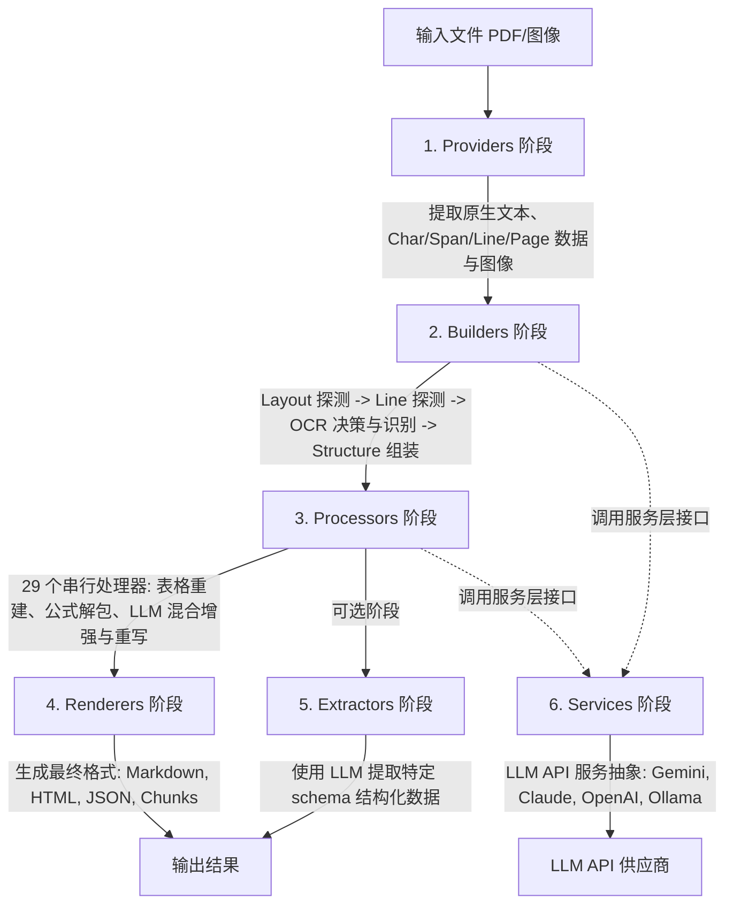
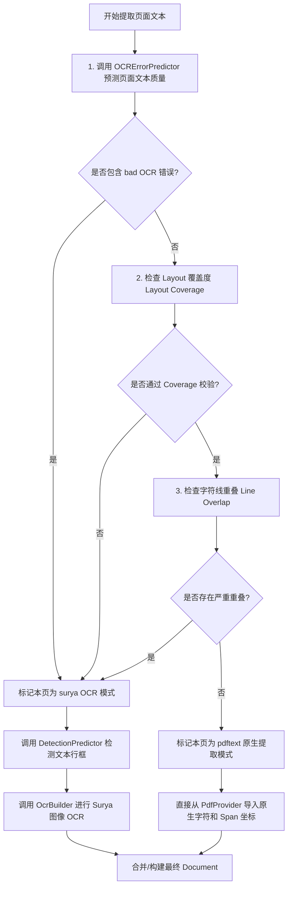
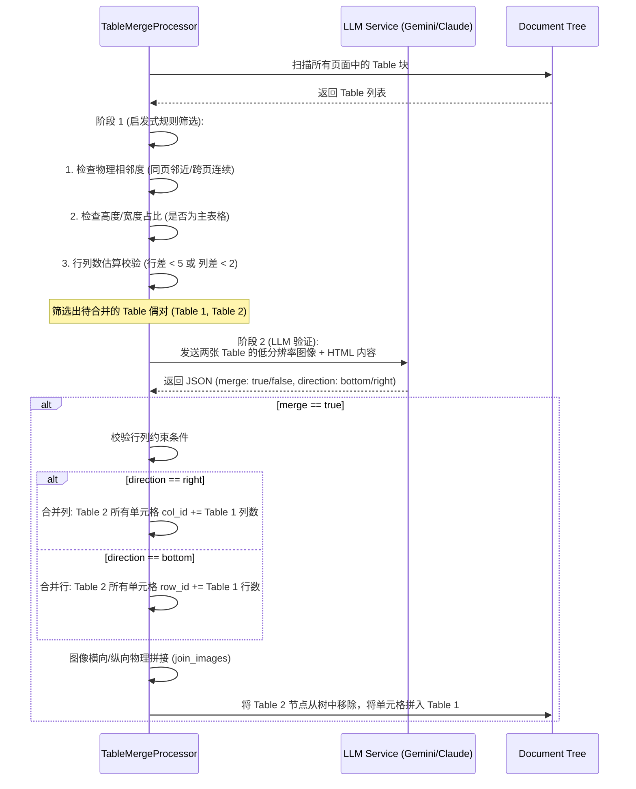
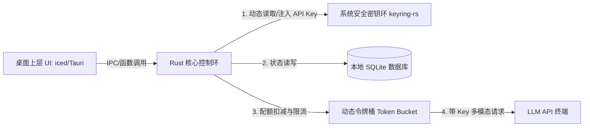

# Marker 核心架构深度解析与 Rust 高性能桌面端落地技术指南

## 1. 架构概述与流水线设计 (Architecture & Pipeline)

Marker 采用了一个高度模块化的**管道/流水线（Pipeline）架构**，核心目标是将复杂的 PDF 或图像输入，转换为高质量、结构化、排版良好的 Markdown 或 JSON 格式。整个管道被划分为 **6 个核心处理阶段**：



### 1.1 六大核心阶段职责
1. **Providers（输入源提供者）**：
   - 封装对物理文件格式的低级读取。例如，`PdfProvider` 使用 `pypdfium2` 和 `pdftext` 解析 PDF 的底层流（字符、字体、编码、坐标），输出包含字符（Char）、跨度（Span）、行（Line）和页面大小等元数据的统一表示形式。
2. **Builders（文档结构构建器）**：
   - 负责文档多模态信息的提取与初步组装。通过调用 `LayoutPredictor`、`DetectionPredictor`、`OCRErrorPredictor` 和 `RecognitionPredictor` 等 Surya 深度学习模型，确定页面的逻辑分块（图片、表格、文本段落、公式），决定是否需要启动 OCR，提取 OCR 字符并对齐回文档的树形结构中。
3. **Processors（后处理器）**：
   - 对初步构建的文档进行 29 个处理器的串行加工。包含表格转换与合并（`TableProcessor`, `LLMTableMergeProcessor`）、公式识别（`EquationProcessor`）、列表合并（`ListProcessor`）、目录生成（`DocumentTOCProcessor`）以及一系列基于大语言模型的精修处理器。
4. **Renderers（输出渲染器）**：
   - 将处理器精修后的内存文档树形结构渲染为物理表达。`MarkdownRenderer` 使用 `markdownify` 将文档节点翻译为具有跨行/跨列合并表格、规范 LaTeX 公式和清晰标题层级的 Markdown 文本。
5. **Extractors（信息提取器）**：
   - 属于可选阶段，主要借助大语言模型的多轮提示词与 Schema 约束，直接将文档内容转换为特定的 JSON 数据模型。
6. **Services（语言模型服务层）**：
   - 统一大模型 API 的调用抽象（如 `GoogleGeminiService`、`AnthropicService`、`OllamaService`），提供流控、重试、多模态图像打包及结构化 JSON 返回等能力。

---

## 2. 核心模块与组件深度剖析 (Module Breakdown)

### 2.1 Schema（数据模型与类型系统）
Marker 在 `marker/schema` 中定义了一个严谨的树状层级数据模型。其基本组成如下：
- **`BlockTypes`（枚举）**：包含 27 种类型，如 `Line`（文本行）、`Span`（同属性文本段）、`Char`（字符）、`Table`（表格）、`Equation`（行间公式）、`ListItem`（列表项）、`Header`（标题）等。
- **对象树形层级**：
  $$\text{Document} \rightarrow \text{PageGroup (Page)} \rightarrow \text{Layout Block} \rightarrow \text{Line} \rightarrow \text{Span} \rightarrow \text{Char}$$
  其中 `Group`（如 `FigureGroup`、`TableGroup`）能将相关的元素块（包括图表和它们的 Caption）组合在一起。
- **`BLOCK_REGISTRY`（动态类型映射）**：
  使用 Python 的动态注册机制，支持通过 `register_block_class` 覆盖特定 `BlockTypes` 的默认行为，为重构和业务扩展提供了极大的灵活性。

### 2.2 Providers（物理提取与规格化）
`PdfProvider` 继承自 `BaseProvider`。其核心工作包含：
1. **DPI 适配获取页面图像**：利用 `pypdfium2` 对 PDF 进行多重 DPI 光栅化，获得供后续阶段使用的 PIL 图像。
2. **底层文本与边界盒分析**：调用 `pdftext` 进行字符级的坐标提取。
3. **乱码检测与编码规格化**：分析字体 Flag 和 Space，识别由不规范字体集造成的空白符和乱码字符，为 `LineBuilder` 的 OCR 决策提供输入。

### 2.3 Builders（多模态文档生成）
1. **`DocumentBuilder`**：总协调器，传入 `provider`，依次驱动 `layout_builder`、`line_builder`、`ocr_builder` 和 `structure_builder` 构建出基准 Document 树。
2. **`LayoutBuilder`**：调用 `Surya LayoutPredictor`。
   - 使用 **低分辨率图像（96 DPI）** 进行推理以提升速度。
   - 获得布局检测结果（`LayoutBox`，包含 `label`、`polygon`、`top_k` 概率映射）。
   - **包围盒外扩机制（Expand）**：对于 `Picture`、`Figure`、`ComplexRegion`，为了包裹漏检的外溢元素，计算其与其他 Block 的 `minimum_gap`，并在最大限制（`max_expand_frac = 5\%`）内向外延展。
3. **`LineBuilder`**：检测物理文本行，进行关键的 **"Native PDF Text 还是 Surya OCR"** 判定。
4. **`OcrBuilder`**：驱动 OCR 引擎，支持**块模式（Block Mode）**和**行模式（Line Mode）**的双轨 OCR 文本识别。
5. **`StructureBuilder`**：依据布局结果重新编排块与块之间的嵌套、归属关系（例如将 `Caption` 和 `Table` 聚合到 `TableGroup` 中）。

### 2.4 Processors（29 个串行处理器流水线）
在 `PdfConverter` 初始化时，会通过 `initialize_processors` 组装处理器数组。这 29 个处理器按特定顺序执行（如 `OrderProcessor` $\rightarrow$ `BlockRelabelProcessor` $\rightarrow$ ... $\rightarrow$ `TableProcessor` $\rightarrow$ `LLMTableMergeProcessor` $\rightarrow$ ... $\rightarrow$ `DebugProcessor`），包含两大类：
- **普通处理器**（如 `LineMergeProcessor`, `CodeProcessor`）：纯规则或借助本地模型的逻辑处理。
- **LLM 处理器**（如 `LLMTableProcessor`, `LLMMathBlockProcessor`）：通过 LLM 进行文本修补、表格修复、公式精细转换。

---

## 3. 关键算法与业务逻辑机制 (Key Algorithms)

### 3.1 两阶段文本提取算法 (Two-Phase Text Extraction)
Marker 为兼顾转换速度和公式、扫描件的识别精度，设计了两阶段混合文本提取算法：



#### 决策数学与校验细节
1. **Layout Coverage Check（布局覆盖度检查）**：
   - 提取所有排除了图表、表格等类型的 Layout Block $B_L$，以及原生 `pdftext` 导出的文本行包围盒 $B_P$。
   - 使用 NumPy 矩阵化计算 $B_L$ 与 $B_P$ 的相交面积矩阵 $M_{\text{intersect}}$：
     $$\text{intersect\_lines} = \text{count\_nonzero}(M_{\text{intersect}}[i] > 0)$$
   - 若某一 Layout Block 与原生文本行的相交行数 $\ge \text{layout\_coverage\_min\_lines}$（默认 1），则认为该块被成功覆盖。
   - 覆盖率 $\text{ratio} = \frac{\text{covered\_blocks}}{\text{total\_blocks}}$，当且仅当 $\text{ratio} \ge \text{layout\_coverage\_threshold}$（默认 0.25）时，判定通过。
2. **Line Overlaps Check（文本行重叠检查）**：
   - 原生 PDF 中有时因为排版或文字叠加导致乱码。
   - 计算所有原生 PDF 文本行 $B_P$ 与自身的相交矩阵。
   - 若某一行与其他行的重叠度（相交面积比例）大于 $\text{provider\_line\_provider\_line\_min\_overlap\_pct}$（默认 10%）的次数 $> 2$（包含自身一次），则立即判定原生文本不可信，强制退化到 OCR 阶段。

---

### 3.2 动态依赖注入设计 (Dynamic Dependency Injection)
Marker 通过 `BaseConverter.resolve_dependencies()` 方法实现高度解耦的动态注入：
- **签名内省（Signature Introspection）**：
  利用 Python `inspect.signature(cls.__init__)` 反射构造函数的参数列表。
- **参数动态匹配**：
  - 如果参数名为 `config`，则注入全局的配置字典或 Pydantic Model；
  - 如果参数名存在于全局的 `artifact_dict` 中（存储了加载完毕的 5 个 Surya 深度学习模型、LLM Service 实例等），则直接将对应实例作为入参传入；
  - 如果存在默认值，则保留默认值；
  - 否则抛出依赖无法解析的异常。
- **配置覆盖设计 (`assign_config`)**：
  支持扁平配置的动态向下传递。例如，在配置字典中传递 `MarkdownRenderer_remove_blocks = [...]`，`assign_config` 在实例化 `MarkdownRenderer` 时会提取前缀并将其安全绑定到 `renderer.remove_blocks` 上。

---

### 3.3 LLM 混合增强与元批处理 (LLM Hybrid Enhancement)
多模态大模型的 API 调用通常是整个管道的吞吐量瓶颈，Marker 进行了两级优化：
1. **LLM 简单块合并元处理器（LLMSimpleBlockMetaProcessor）**：
   在 `initialize_processors` 阶段，BaseConverter 会扫描所有继承自 `BaseLLMSimpleBlockProcessor` 的处理器。
   - 将它们从普通的串行列表里抽离出来；
   - 用一个 `LLMSimpleBlockMetaProcessor`（元处理器）把这些简单处理器包裹；
   - **元批处理（Meta-Batching）**：元处理器在执行时，遍历页面所有简单块，把拼装好的多次 LLM 简单调用（例如单词连字符修复、段落段首段尾截断拼接等）打包成一个大 Prompt 批处理发送给大模型，最终再将结果拆分写回，极大地节省了网络 RTT 和 API 消耗。
2. **复杂处理器多线程并发**：
   对于跨页表格合并（`LLMTableMergeProcessor`）这类重度复杂块处理器，使用 `ThreadPoolExecutor` 并发池（默认并发数 3）来提高多页文档并发推理的效率。

---

### 3.4 跨页表格处理与合并算法 (Cross-Page Table Merging)
当表格跨越物理页码时，Marker 采用启发式筛选与 LLM 二阶段校验的算法将其合并：



#### 关键技术点：
- **`join_cells`**：如果是 `right` 方向合并（横向列拼接），将 Table 2 中所有 TableCell 的 `col_id` 偏移加上 Table 1 的最大列数；如果是 `bottom` 方向合并（纵向行拼接），将 Table 2 的 `row_id` 偏移加上 Table 1 的最大行数。
- **`join_images`**：使用图像库，在内存中拼接两个子表格的图片，更新 `start_block.lowres_image`。

---

### 3.5 公式识别与 LaTeX 解包处理 (Equation & LaTeX Unwrapping)
1. **Surya Math 识别**：
   OCR 时遇到 `<math>` 标签包裹的区域，OCR 模型将输出 LaTeX 语法。
2. **`unwrap_math` 算法**：
   在 recognition 中，识别模型可能会为原本不是数学公式的区域强加 `<math>` 标签。Marker 在 `util.py` 中实现了解包机制：
   - 提取 `<math>` 的内部文本，移去前后可能多余的换行符和转义符 `\\\\`；
   - 剥离 LaTeX 中的 `\\text{...}` 辅助格式；
   - 还原 LaTeX 常见的符号转义（例如将 `\\%` 恢复为 `%`，`\\$` 恢复为 `$`）；
   - **数学敏感度检查**：检查处理后的字符串是否还包含数学符号集 `["^", "_", "\\", "{", "}"]`。如果不包含任何特殊数学算子，说明其为纯文本，立即将外层的 `<math>` 标签**解包（Unwrap）**恢复为常规字符，防止排版污染。

---

## 4. Rust 高精度、低内存桌面端落地方案 (Rust Implementation)

为了在 Rust 中设计并实现这一管道，并将其包装为高性能、低内存占用的跨平台桌面应用（对标用户 4 个目标），我们建议采用如下的工程架构设计：

### 4.1 Rust 模块解耦与动态依赖注入 (Dynamic DI & Registry)
在 Python 中，依赖注入依赖于运行时的反射（`inspect`）。Rust 是静态编译型语言，若想实现模块的深度解耦与配置注入，可采用**多通道 Context（上下文）设计模式**或**动态 Service Registry（服务注册中心）**：

```rust
// 统一的运行时 Pipeline 上下文
pub struct PipelineContext {
    pub config: AppConfig,
    pub registry: ServiceRegistry,
}

// 动态注册中心，使用 std::any::Any 容纳不同的 Surya 模型和 LLM 适配器
pub struct ServiceRegistry {
    services: HashMap<TypeId, Box<dyn Any + Send + Sync>>,
}

impl ServiceRegistry {
    pub fn register<T: Send + Sync + 'static>(&mut self, service: T) {
        self.services.insert(TypeId::of::<T>(), Box::new(service));
    }

    pub fn resolve<T: 'static>(&self) -> Option<&T> {
        self.services.get(&TypeId::of::<T>())?.downcast_ref::<T>()
    }
}
```

- **基于 Trait 的流水线阶段**：
  为 Provider, Builder, Processor, Renderer 分别定义生命周期绑定 Trait，并在执行 `run` 时，将 `&PipelineContext` 隐式传递给各个模块，实现动态解析与配置分发。

```rust
pub trait DocumentProcessor {
    fn name(&self) -> &'static str;
    fn process(&self, doc: &mut Document, ctx: &PipelineContext) -> Result<()>;
}
```

---

### 4.2 本地轻量化推理引擎方案 (Local Inference via ONNX Runtime)
为避免在桌面端打包巨大的 PyTorch/LibTorch 运行时（占用数 GB 内存和包体），建议在 Rust 中整合 **ONNX Runtime (ORT)** 来驱动 Surya 模型：
- **依赖库选型**：使用 [`ort` 库 (Rust wrapper for ONNX Runtime)](https://github.com/pyort/ort)。
- **硬件加速支持**：
  - Windows：使用 `DirectML`（支持绝大多数 AMD/Nvidia/Intel 显卡）。
  - macOS：使用 `CoreML` / `Metal`。
  - CPU 降级：使用多线程并启的 `OpenMP` 或 `MKL` 作为默认执行提供程序（EP）。
- **惰性装载与显存释放（Lazy Loading & Unloading）**：
  - 启动应用时，**仅加载 LayoutPredictor 和 DetectionPredictor**（低分辨率 96 DPI 输入，模型极小，常驻内存）。
  - 当且仅当 `LineBuilder` 检查到 OCR 错误、Coverage 不合格，需要退化到 OCR 阶段时，**惰性加载 (Lazy Load) `RecognitionPredictor`**。
  - 处理完毕后，通过 Rust 的 RAII 机制，或主动调用模型 Drop 释放底层的 Tensor 物理显存，将桌面端应用底噪内存控制在 300MB 以内。

---

### 4.3 库对应与数据流替换 (Library Mappings)
对于 Marker 的 Python 依赖，Rust 生态有着极佳的对应方案，可以保障原生提取效率：

| 功能模块 | Python 库 | Rust 替代方案 (库) | 落地优势与设计注意事项 |
| :--- | :--- | :--- | :--- |
| **PDF 物理流解析** | `pdftext` / `pypdfium2` | [`lopdf`](https://github.com/J-F-F/lopdf) + [`pdfium-render`](https://github.com/dupe拆/pdfium-render) | `lopdf` 用于极速读取 PDF 逻辑结构树与字体表；`pdfium-render` 绑定动态库以供高保真渲染双 DPI 图像。 |
| **图像读取与裁剪** | `PIL` | [`image` crate](https://github.com/image-rs/image) | 纯 Rust 实现，配合 [`imageproc`](https://github.com/image-rs/imageproc) 进行多边形包围盒的极速裁剪与坐标映射，避免内存溢出。 |
| **矩阵相交运算** | `numpy` | [`ndarray`](https://github.com/rust-ndarray/ndarray) | 使用 Rust 的多维数组进行向量化相交面积计算，可无缝并行化。 |
| **Markdown 转化** | `markdownify` | 自研 AST 渲染树 + `pulldown-cmark` | 顺应 Marker 内部的 HTML 标记重建逻辑，直接在内存中将 AST 文档树转换成标准 Markdown 字符串。 |

---

### 4.4 桌面端多账户配额管理系统 (Local Quota & Key Management)
针对桌面端应用的用户配额与 API Key 动态更新需求，设计如下安全架构：



1. **安全凭据存储**：
   集成 [`keyring-rs`](https://github.com/hwchen/keyring-rs) 库，将大模型 API Key（Gemini, OpenAI 等）写入操作系统原生密钥管理器（Windows Credential Manager / macOS Keychain），**严禁以明文形式写入 SQLite 数据库**。
2. **两阶段配额管理与限流**：
   - 本地轻量化 SQLite 维护配额日志表（`quota_transactions`），记录转换页数、字符数和模型调用时间。
   - 使用 **令牌桶（Token Bucket）** 算法限制每分钟最大请求量（RPM）和每日最高使用额度，当本地调用次数触发临界值时在桌面 UI 弹出拦截提示。
   - 在 `PipelineContext` 中订阅 Key 变更事件，一旦用户更改配置，调用 `keyring` 刷新句柄，并在下次 LLM 阶段执行前通过运行时上下文（Context）即时应用，无需重启进程。

---

### 4.5 双通道双 DPI 图像管道设计 (Double-Channel DPI Pipeline)
为降低内存消耗并保持 OCR 文字清晰度，必须在 Rust 中实现**双通道物理图像管道**：
- **通道 A（96 DPI 低分辨率通道）**：
  - PDF 开关只渲染 96 DPI 图像，供 `LayoutBuilder` 和 `LineBuilder` 的 Detection 模型使用。
  - 推理时单页图像内存占用极小。
- **通道 B（192 DPI 高分辨率局部通道）**：
  - 不做整页高 DPI 渲染。
  - 只有在判定该区域需要 OCR 时，才向 `pdfium-render` 发起局部裁剪区域的 192 DPI 高精度光栅化渲染，或者只对发生 OCR 的 Page 渲染 192 DPI。
  - 推理完毕后，图像对象随即被 Drop，保障极佳的内存水线。
